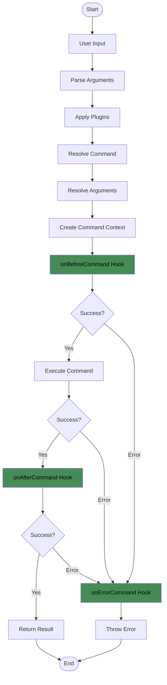
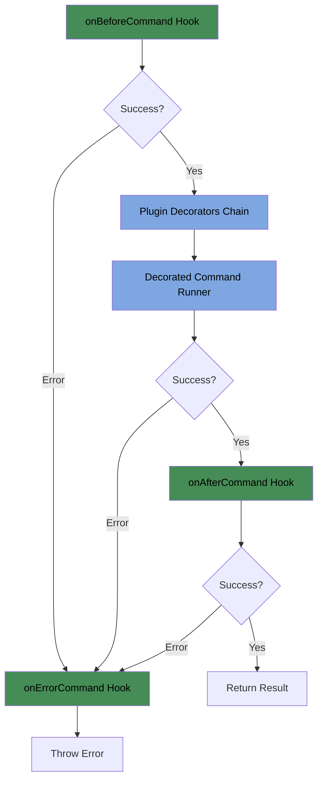

# Command Hooks

Gunshi provides powerful lifecycle hooks that allow you to intercept and control command execution at various stages. These hooks enable advanced scenarios like logging, monitoring, validation, and error handling.

## Understanding Command Lifecycle

The command execution lifecycle in Gunshi follows these stages:



## Available Hooks

Gunshi provides three main lifecycle hooks:

- **`onBeforeCommand`**: Executes before the command runs
- **`onAfterCommand`**: Executes after successful command completion
- **`onErrorCommand`**: Executes when a command throws an error

## Basic Hook Usage

### Setting Up Hooks

Hooks are configured at the CLI level in the options:

```ts
import { cli } from 'gunshi'

await cli(
  process.argv.slice(2),
  {
    name: 'server',
    run: ctx => {
      console.log('Starting server...')
    }
  },
  {
    name: 'my-app',
    version: '1.0.0',

    // Define lifecycle hooks
    onBeforeCommand: async ctx => {
      console.log(`About to run: ${ctx.name}`)
    },

    onAfterCommand: async (ctx, result) => {
      console.log(`Command ${ctx.name} completed successfully`)
    },

    onErrorCommand: async (ctx, error) => {
      console.error(`Command ${ctx.name} failed:`, error)
    }
  }
)
```

### Hook Parameters

Each hook receives different parameters:

```ts
{
  // Before command execution
  onBeforeCommand?: (ctx: Readonly<CommandContext>) => Awaitable<void>

  // After successful execution
  onAfterCommand?: (ctx: Readonly<CommandContext>, result: string | undefined) => Awaitable<void>

  // On command error
  onErrorCommand?: (ctx: Readonly<CommandContext>, error: Error) => Awaitable<void>
}
```

## Use cases

### Logging and Monitoring

Implement comprehensive logging across all commands:

```ts
import { cli } from 'gunshi'
import { createLogger } from './logger'

const logger = createLogger()

await cli(process.argv.slice(2), commands, {
  name: 'my-app',

  onBeforeCommand: async ctx => {
    // Log command start with arguments
    logger.info('Command started', {
      command: ctx.name,
      args: ctx.values,
      timestamp: new Date().toISOString()
    })
  },

  onAfterCommand: async (ctx, result) => {
    // Log successful completion
    logger.info('Command completed', {
      command: ctx.name,
      duration: Date.now() - ctx.startTime,
      result: typeof result
    })
  },

  onErrorCommand: async (ctx, error) => {
    // Log errors with full context
    logger.error('Command failed', {
      command: ctx.name,
      error: error.message,
      stack: error.stack,
      args: ctx.values
    })
  }
})
```

### Performance Monitoring

Track command execution times and performance metrics:

```ts
interface PerformanceMetrics {
  command: string
  startTime: number
  endTime?: number
  duration?: number
  status: 'started' | 'completed' | 'failed'
  error?: string
}

const metrics: Map<string, PerformanceMetrics> = new Map()

const performanceHooks = {
  onBeforeCommand: async (ctx: CommandContext) => {
    const key = `${ctx.name}-${Date.now()}`
    metrics.set(key, {
      command: ctx.name,
      startTime: Date.now(),
      status: 'started'
    })

    // Store key in context for later retrieval
    ;(ctx as any).__metricsKey = key
  },

  onAfterCommand: async (ctx: CommandContext, result: string | undefined) => {
    const key = (ctx as any).__metricsKey
    const metric = metrics.get(key)

    if (metric) {
      metric.endTime = Date.now()
      metric.duration = metric.endTime - metric.startTime
      metric.status = 'completed'

      // Send to monitoring service
      await sendMetrics(metric)
    }
  },

  onErrorCommand: async (ctx: CommandContext, error: Error) => {
    const key = (ctx as any).__metricsKey
    const metric = metrics.get(key)

    if (metric) {
      metric.endTime = Date.now()
      metric.duration = metric.endTime - metric.startTime
      metric.status = 'failed'
      metric.error = error.message

      // Send to monitoring service
      await sendMetrics(metric)
    }
  }
}
```

### Validation and Guards

Use hooks to implement global validation or access control:

```ts
import { verifyAuth } from './auth'

const authHooks = {
  onBeforeCommand: async (ctx: CommandContext) => {
    // Skip auth for certain commands
    const publicCommands = ['help', 'version', 'login']
    if (publicCommands.includes(ctx.name || '')) {
      return
    }

    // Verify authentication
    const token = process.env.AUTH_TOKEN || ctx.values.token
    if (!token) {
      throw new Error('Authentication required. Please run "login" first.')
    }

    const isValid = await verifyAuth(token)
    if (!isValid) {
      throw new Error('Invalid or expired token. Please login again.')
    }

    // Store user info in context for command use
    ;(ctx as any).user = await getUserInfo(token)
  }
}
```

### Transaction Management

Implement database transactions or rollback mechanisms:

```ts
import { db } from './database'

const transactionHooks = {
  onBeforeCommand: async (ctx: CommandContext) => {
    // Start transaction for data-modifying commands
    const transactionalCommands = ['create', 'update', 'delete', 'migrate']

    if (transactionalCommands.includes(ctx.name || '')) {
      const transaction = await db.beginTransaction()
      ;(ctx as any).__transaction = transaction
    }
  },

  onAfterCommand: async (ctx: CommandContext, result: string | undefined) => {
    const transaction = (ctx as any).__transaction

    if (transaction) {
      // Commit on success
      await transaction.commit()
      console.log('Transaction committed successfully')
    }
  },

  onErrorCommand: async (ctx: CommandContext, error: Error) => {
    const transaction = (ctx as any).__transaction

    if (transaction) {
      // Rollback on error
      await transaction.rollback()
      console.error('Transaction rolled back due to error:', error.message)
    }
  }
}
```

## Hook Execution Order

### CLI Hooks vs Plugin Decorators

Gunshi provides two distinct mechanisms for controlling command execution:

1. **CLI-level Hooks**: Observation and control points that run **before and after** command execution
   - `onBeforeCommand`: Pre-execution processing (logging, validation, initialization)
   - `onAfterCommand`: Post-success processing (cleanup, metrics recording)
   - `onErrorCommand`: Error handling (error logging, rollback)

2. **Plugin Decorators**: **Wrap** the command itself to modify its behavior
   - `decorateCommand`: Wraps command runner to add or modify functionality
   - Multiple plugins can chain decorators (decorator pattern)

### Execution Flow



### Detailed Execution Sequence

1. **`onBeforeCommand` Hook** - Pre-execution setup and validation
2. **Plugin Decorator Chain** - Command wrapping by plugins
   - Applied in reverse order (LIFO - last registered, first executed)
   - Each decorator wraps the next runner in the chain
3. **Command Runner** - Actual command execution
4. **`onAfterCommand` Hook** - Post-success processing
5. **`onErrorCommand` Hook** - Error handling when exceptions occur

### Plugin Decorator Example

```ts
// Using decorateCommand in a plugin
export default plugin({
  id: 'timing-plugin',
  setup: ctx => {
    // Wrap command execution to measure execution time
    ctx.decorateCommand(baseRunner => {
      return async commandCtx => {
        const start = Date.now()
        try {
          const result = await baseRunner(commandCtx)
          console.log(`Execution time: ${Date.now() - start}ms`)
          return result
        } catch (error) {
          console.log(`Failed after: ${Date.now() - start}ms`)
          throw error
        }
      }
    })
  }
})
```

> [!NOTE]
> Plugins don't have CLI-level hooks (`onBeforeCommand`, etc.). Instead, they use the `decorateCommand` method to wrap command execution and add custom logic. This allows plugins to extend and modify command behavior through the decorator pattern.

## Next Steps

- Explore [Rendering Customization](./rendering-customization.md) for UI control
- Learn about [Type System](./type-system.md) for type-safe hooks
- See [Plugin Lifecycle](/guide/plugin/lifecycle.md) for plugin-specific hooks
