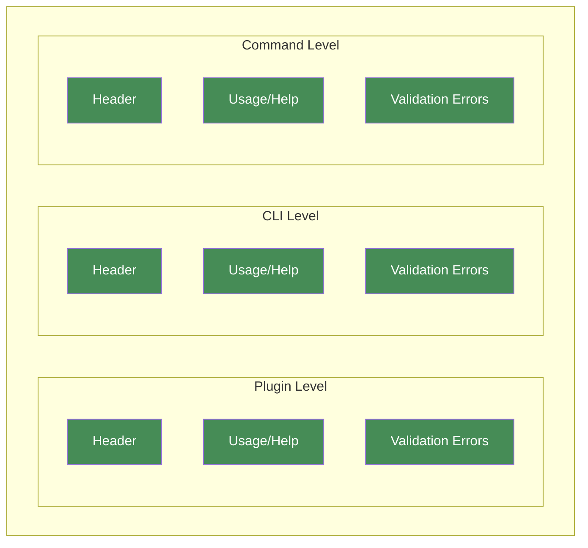
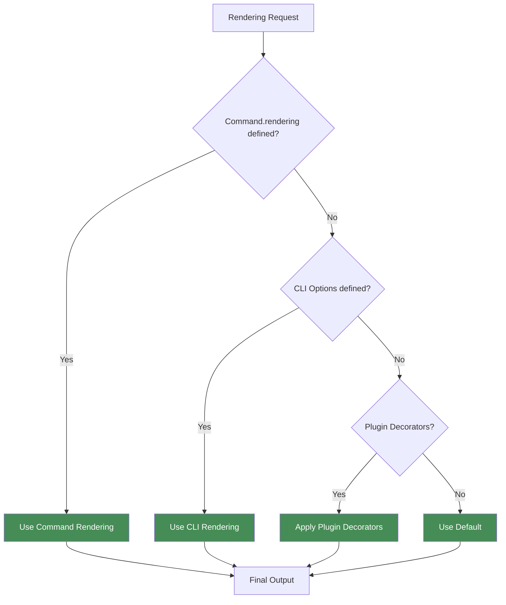
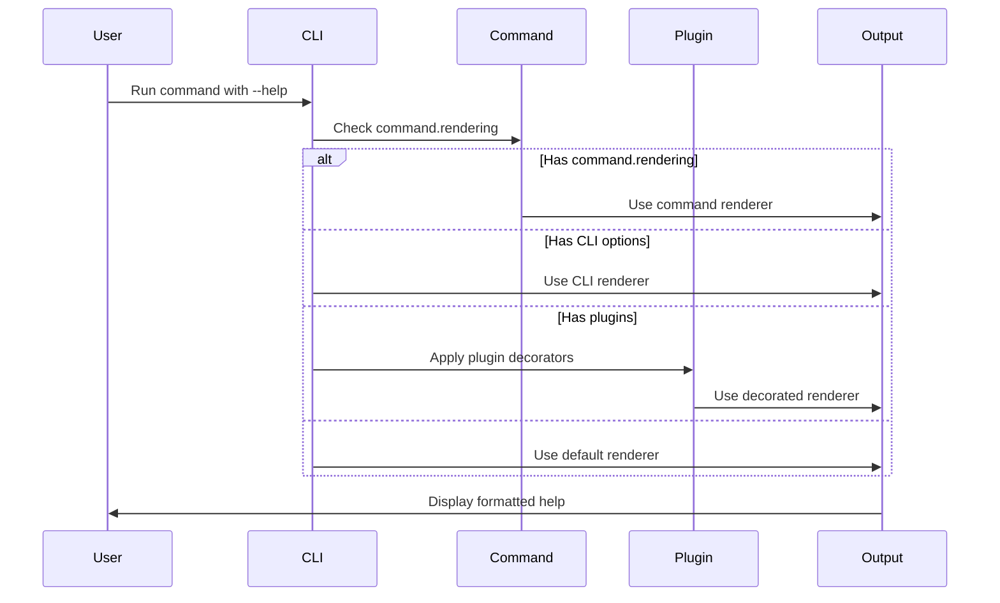

# Custom Rendering

Gunshi provides a flexible rendering system that allows you to customize how your CLI displays help text, usage information, and error messages.

## Overview

Gunshi provides three levels of customization, each capable of controlling all rendering components (Header, Usage/Help, and Validation Errors).

When multiple levels define the same renderer, the higher priority level wins.

Customizing rendering offers several benefits:

- **Branding**: Match your CLI's help messages to your project's style
- **Clarity**: Organize information in a way that makes sense for your users
- **Flexibility**: Add custom sections or formatting to help messages
- **Consistency**: Ensure help messages follow your organization's standards

## Three-Level Customization System



The diagram above illustrates Gunshi's three-level rendering customization system.

Each level can independently control three rendering components:

- **Header**: The title section of help text, typically showing the CLI name and version
- **Usage/Help**: The main help content including command syntax, options, and arguments
- **Validation Errors**: Error messages shown when command arguments fail validation

The levels work in a priority hierarchy where:

- **Command Level** (top) has the highest priority and overrides all other levels
- **CLI Level** (middle) provides defaults for all commands in your application
- **Plugin Level** (bottom) adds reusable rendering logic through decorators

## Renderer Resolution

Gunshi checks each customization level in priority order (Command → CLI → Plugin) and uses the first renderer it finds:



## How It Works

This example shows the rendering resolution flow when a user runs a command with `--help`:



## Command-Level Rendering

The most specific way to customize rendering is at the command level. Use this when:

- A specific command needs unique formatting or branding
- Different commands require different help layouts
- You want to override global settings for particular commands

### Understanding Command Context

All renderer functions receive a Command Context object as their first parameter.

This context provides comprehensive information about the current command execution state, including configuration, arguments, environment details, and more.

```js
// Renderer functions receive context as their first argument
renderHeader: ctx => {
  // ctx contains all command execution information
  return `${ctx.env.name} - ${ctx.description}`
}
```

> [!NOTE]
> The Command Context (`ctx`) is a read-only object that provides access to command metadata, parsed arguments, environment configuration, and plugin extensions. For the complete CommandContext API reference including all properties and types, see the [CommandContext interface documentation](../../api/default/interfaces/CommandContext).

### Basic Example

The following example demonstrates how to customize rendering at the command level for a watch command that needs specialized formatting for its interactive mode.

Notice how the renderer functions receive a Command Context (`ctx`) parameter that provides access to command information:

```ts
import { define } from 'gunshi'

const command = define({
  name: 'watch',
  description: 'Watch files and rebuild on changes',

  // Command-specific rendering for interactive watch mode
  rendering: {
    header: ctx => {
      return `👁️  WATCH MODE - Press Ctrl+C to stop`
    },

    usage: ctx => {
      return `Usage: ${ctx.name} [options]

Watch Options:
  --entry <file>     Entry point (default: src/index.ts)
  --out <dir>        Output directory (default: dist)
  --ignore <pattern> Ignore patterns

Keyboard Shortcuts (during watch):
  r - Force rebuild
  c - Clear console
  q - Quit watch mode`
    },

    validationErrors: (ctx, error) => {
      // Watch-specific error formatting
      return `⚠️  Watch mode cannot start:\n${error.errors.map(err => `   • ${err.message}`).join('\n')}`
    }
  },

  run: async ctx => {
    // Command logic ...
  }
})
```

### Practical Examples

Here's how to create custom renderers for specific use cases:

```js
import { cli } from 'gunshi'

// Define a custom header renderer with fancy formatting
const customHeaderRenderer = ctx => {
  const lines = []

  // Add a fancy header
  lines.push('╔═════════════════════════════════════════╗')
  lines.push(`║ ${ctx.env.name.toUpperCase().padStart(20).padEnd(39)} ║`)
  lines.push('╚═════════════════════════════════════════╝')

  // Add description and version
  if (ctx.env.description) {
    lines.push(ctx.env.description)
  }

  if (ctx.env.version) {
    lines.push(`Version: ${ctx.env.version}`)
  }

  lines.push('')

  // Return the header as a string
  return lines.join('\n')
}

// Define your command
const command = {
  name: 'app',
  description: 'My application',
  args: {
    name: {
      type: 'string',
      short: 'n',
      description: 'Name to use'
    }
  },
  run: ctx => {
    // Command implementation
  }
}

// Run the command with the custom header renderer
await cli(process.argv.slice(2), command, {
  name: 'my-app',
  version: '1.0.0',
  description: 'A CLI application with custom usage generation',
  renderHeader: customHeaderRenderer
})
```

When users run `node app.js --help`, they'll see your custom header:

```sh
╔═════════════════════════════════════════╗
║               MY-APP                    ║
╚═════════════════════════════════════════╝
A CLI application with custom usage generation
Version: 1.0.0


USAGE:
  my-app <OPTIONS>

OPTIONS:
  -n, --name <name>          Name to use
  -h, --help                 Display this help message
  -v, --version              Display this version
```

### Disabling Renderers

Set any renderer to `null` to disable it:

```ts
rendering: {
  header: null,           // No header
  usage: async () => '...' // Custom usage
}
```

## CLI-Level Rendering

Set default renderers for all commands in your CLI. Use this when:

- You want consistent formatting across your entire application
- All commands should share the same branding or style
- You need a baseline that individual commands can override

### Basic Configuration

```ts
import { cli } from 'gunshi'

await cli(process.argv.slice(2), command, {
  name: 'my-cli',
  version: '1.0.0',

  // Apply to all commands
  renderHeader: ctx => {
    return `=== ${ctx.env.name} v${ctx.env.version} ===`
  },

  renderUsage: ctx => {
    return `${ctx.env.name} ${ctx.name || 'command'} [options]`
  },

  renderValidationErrors: (ctx, error) => {
    return `Error: ${error.message}`
  }
})
```

### Combined Renderers Example

You can combine all three custom renderers for a completely customized help experience:

```js
import { cli } from 'gunshi'

// Define a command
const command = {
  name: 'task-manager',
  description: 'A task management utility',
  args: {
    add: {
      type: 'string',
      short: 'a',
      description: 'Add a new task'
    },
    list: {
      type: 'boolean',
      short: 'l',
      description: 'List all tasks'
    },
    complete: {
      type: 'string',
      short: 'c',
      description: 'Mark a task as complete'
    },
    priority: {
      type: 'string',
      short: 'p',
      description: 'Set task priority (low, medium, high)'
    },
    due: {
      type: 'string',
      short: 'd',
      description: 'Set due date in YYYY-MM-DD format'
    }
  },
  examples: `# Add a new task
$ task-manager --add "Complete the project"

# Add a task with priority and due date
$ task-manager --add "Important meeting" --priority high --due 2023-12-31

# List all tasks
$ task-manager --list

# Mark a task as complete
$ task-manager --complete "Complete the project"`,
  run: ctx => {
    // Command implementation
  }
}

// Define custom usage renderer
const customUsageRenderer = ctx => {
  const lines = []
  lines.push('📋 USAGE:')
  lines.push(`  ${ctx.env.name} [options]`)
  lines.push('')
  lines.push('⚡ QUICK START:')
  lines.push('  Run with --help for detailed options')
  return lines.join('\n')
}

// Define custom validation errors renderer
const customValidationErrorsRenderer = (ctx, error) => {
  const lines = []
  lines.push('❌ VALIDATION ERROR')
  lines.push('────────────────────')

  // Display each validation error
  for (const e of error.errors) {
    lines.push(`  • ${e.message}`)
  }

  lines.push('')
  lines.push('💡 TIP: Use --help to see valid options')
  return lines.join('\n')
}

// Run the CLI with all custom renderers
await cli(process.argv.slice(2), command, {
  name: 'task-manager',
  version: '1.0.0',
  description: 'A task management utility',
  renderHeader: customHeaderRenderer,
  renderUsage: customUsageRenderer,
  renderValidationErrors: customValidationErrorsRenderer
})
```

## Plugin-Level Rendering

Plugins provide the most powerful way to customize rendering across your entire CLI.

They can decorate renderers to add consistent behavior across all commands.

> [!NOTE]
> Plugin-level rendering has the lowest priority in the rendering hierarchy. Command-level and global-level renderers will override plugin decorators. For detailed information on how renderer decorators work and how to implement them, see the [How Renderer Decorators Work](../plugin/decorators.md#how-renderer-decorators-work) documentation.

### Using the Built-in Renderer Plugin

The `@gunshi/plugin-renderer` package provides enhanced rendering out of the box:

```ts
import { cli } from 'gunshi/bone'
import renderer from '@gunshi/plugin-renderer'

await cli(process.argv.slice(2), command, {
  name: 'my-cli',
  plugins: [
    renderer() // Adds enhanced rendering
  ]
})
```

The built-in renderer provides complete rendering implementations with improved formatting and visual hierarchy.

Unlike decorator plugins, it replaces the default rendering entirely.

> [!TIP]
> For detailed features of the built-in renderer plugin, see the [documentation](https://github.com/kazupon/gunshi/blob/main/packages/plugin-renderer/README.md).

### Creating a Custom Rendering Plugin

When building rendering plugins, use the decorator pattern to enhance existing output:

```ts
import { plugin } from 'gunshi/plugin'

const colorPlugin = plugin({
  id: 'my:color',
  name: 'Color Plugin',

  setup(context) {
    // Decorate header renderer
    context.decorateHeaderRenderer(async (baseRenderer, ctx) => {
      const output = await baseRenderer(ctx)
      if (!output) return ''

      return `\x1b[36m${output}\x1b[0m` // Add cyan color
    })

    // Decorate error renderer
    context.decorateValidationErrorsRenderer(async (baseRenderer, ctx, error) => {
      const output = await baseRenderer(ctx, error)
      if (!output) return ''

      return `\x1b[31m${output}\x1b[0m` // Add red color
    })
  }
})
```

> [!IMPORTANT]
> Always call `baseRenderer` in your decorators to maintain the plugin chain. This ensures compatibility with other plugins.

### Practical Example: Theme Plugin

Here's a complete theme plugin that enhances all rendering aspects:

```ts
import { plugin } from 'gunshi/plugin'

const oceanThemePlugin = plugin({
  id: 'themes:ocean',
  name: 'Ocean Theme',

  setup(context) {
    const colors = {
      header: '\x1b[36m', // Cyan
      usage: '\x1b[34m', // Blue
      error: '\x1b[31m', // Red
      reset: '\x1b[0m'
    }

    // Add wave decoration to headers
    context.decorateHeaderRenderer(async (baseRenderer, ctx) => {
      const output = await baseRenderer(ctx)
      if (!output) return ''

      const waves = '～～～～～'
      return `${colors.header}${waves}\n${output}\n${waves}${colors.reset}`
    })

    // Style usage sections
    context.decorateUsageRenderer(async (baseRenderer, ctx) => {
      const output = await baseRenderer(ctx)
      if (!output) return ''

      return output.replace(/^([A-Z][A-Z\s]+:)$/gm, `${colors.usage}$1${colors.reset}`)
    })

    // Enhance error display
    context.decorateValidationErrorsRenderer(async (baseRenderer, ctx, error) => {
      const output = await baseRenderer(ctx, error)
      if (!output) return ''

      return `${colors.error}⚠️  ERROR\n${output}${colors.reset}`
    })
  }
})
```

### Combining Multiple Rendering Plugins

When using multiple rendering plugins, they execute in the order they are registered.

Each plugin receives the output from the previous one, creating a transformation chain.

Let's create a simple emoji plugin to demonstrate plugin combination:

```ts
import { plugin } from 'gunshi/plugin'

// Define a simple emoji plugin using correct decorator API
const emojiPlugin = plugin({
  id: 'my:emoji',
  name: 'Emoji Decorator',

  setup(context) {
    // Use the correct decorator method for usage rendering
    context.decorateUsageRenderer(async (baseRenderer, ctx) => {
      const output = await baseRenderer(ctx)
      if (!output) return ''

      // Add emoji indicators to section headers
      return output
        .replace(/^USAGE:/gm, '📖 USAGE:')
        .replace(/^OPTIONS:/gm, '⚙️  OPTIONS:')
        .replace(/^COMMANDS:/gm, '📦 COMMANDS:')
        .replace(/^ARGUMENTS:/gm, '🔤 ARGUMENTS:')
        .replace(/^EXAMPLES:/gm, '💡 EXAMPLES:')
    })
  }
})

// Combine with our ocean theme plugin
await cli(process.argv.slice(2), command, {
  name: 'my-cli',
  plugins: [
    renderer(), // Base renderer
    oceanThemePlugin(), // Apply ocean theme colors
    emojiPlugin() // Add emoji indicators
  ]
})
```

#### Understanding the Transformation Chain

Each plugin transforms the output sequentially:

```
1. Base renderer output:
   "Usage: my-cli [options]"

2. After oceanThemePlugin:
   "\x1b[38;5;39mUsage: my-cli [options]\x1b[0m"  (colored)

3. After emojiPlugin:
   "📖 \x1b[38;5;39mUsage: my-cli [options]\x1b[0m"  (emoji + colored)
```

> [!IMPORTANT]
> Plugin order significantly affects the final output. Color plugins should typically come before text modification plugins to ensure ANSI codes don't interfere with pattern matching.

#### Guidelines for Plugin Composition

- **Keep plugins focused**: Each plugin should handle one specific aspect of rendering
- **Consider dependencies**: Some plugins may require others to run first
- **Test combinations**: Verify that your plugins work well together
- **Document requirements**: Clearly state if your plugin expects specific input formats

## Advanced Customization

### Using Colors

You can enhance your custom renderers with colors using libraries like:

- [chalk](https://github.com/chalk/chalk)
- [kleur](https://github.com/lukeed/kleur)
- [picocolors](https://github.com/alexeyraspopov/picocolors)

The following example demonstrates using chalk for colored output:

```js
import { cli } from 'gunshi'
import chalk from 'chalk'

// Custom header renderer with colors
const coloredHeaderRenderer = ctx => {
  const lines = []
  lines.push(chalk.blue('╔═════════════════════════════════════════╗'))
  lines.push(chalk.blue(`║             ${chalk.bold(ctx.env.name.toUpperCase())}                ║`))
  lines.push(chalk.blue('╚═════════════════════════════════════════╝'))

  if (ctx.env.description) {
    lines.push(chalk.white(ctx.env.description))
  }

  if (ctx.env.version) {
    lines.push(chalk.gray(`Version: ${ctx.env.version}`))
  }

  lines.push('')
  return lines.join('\n')
}

// Custom usage renderer with colors
const coloredUsageRenderer = ctx => {
  const lines = []

  lines.push(chalk.yellow.bold('📋 COMMAND USAGE'))
  lines.push(chalk.yellow('═══════════════'))
  lines.push('')

  lines.push(chalk.white.bold('BASIC USAGE:'))
  lines.push(chalk.white(`  $ ${ctx.env.name} [options]`))
  lines.push('')

  if (ctx.args && Object.keys(ctx.args).length > 0) {
    lines.push(chalk.white.bold('OPTIONS:'))

    for (const [key, option] of Object.entries(ctx.args)) {
      const shortFlag = option.short ? chalk.green(`-${option.short}, `) : '    '
      const longFlag = chalk.green(`--${key}`)
      const type = chalk.blue(`[${option.type}]`)
      const required = option.required ? chalk.red(' (required)') : ''

      lines.push(
        `  ${shortFlag}${longFlag.padEnd(15)} ${type.padEnd(10)} ${option.description || key}${required}`
      )
    }

    lines.push('')
  }

  return lines.join('\n')
}

// Run the CLI with colored renderers
await cli(process.argv.slice(2), command, {
  name: 'task-manager',
  version: '1.0.0',
  description: 'A task management utility',
  renderHeader: coloredHeaderRenderer,
  renderUsage: coloredUsageRenderer
})
```

### Working with Command Context

The Command Context object (`ctx`) passed to renderer functions provides access to all information needed to customize your output.

Here are the key property groups and their practical uses:

#### Environment and Metadata

These properties provide information about the CLI and current command:

```js
renderHeader: ctx => {
  // Access CLI-level configuration
  const appName = ctx.env.name // CLI application name
  const version = ctx.env.version // Application version

  // Access command-specific metadata
  const cmdName = ctx.name // Current command name
  const description = ctx.description // Command description

  return `${appName} v${version} - ${cmdName || 'main'}`
}
```

#### Arguments and Values

Access parsed command-line arguments and their values:

```js
renderUsage: ctx => {
  // ctx.args - Command argument schemas
  // ctx.values - Parsed argument values
  // ctx.explicit - Which args were explicitly provided

  const lines = []

  // Show which arguments have default values
  for (const [key, schema] of Object.entries(ctx.args)) {
    const wasProvided = ctx.explicit[key]
    const currentValue = ctx.values[key]

    if (!wasProvided && currentValue !== undefined) {
      lines.push(`  --${key} (default: ${currentValue})`)
    }
  }

  return lines.join('\n')
}
```

#### Positional and Rest Arguments

Handle non-flag arguments:

```js
renderValidationErrors: (ctx, error) => {
  // ctx.positionals - Positional arguments
  // ctx.rest - Arguments after '--' delimiter

  if (ctx.positionals.length > 0) {
    return `Unexpected arguments: ${ctx.positionals.join(', ')}\n${error.message}`
  }

  return error.message
}
```

#### Plugin Extensions

Plugins extend the command context with additional functionality through namespaced extensions.

Each plugin registers its capabilities under a unique plugin ID to prevent conflicts.

When accessing plugin-provided data in custom renderers, you must use the plugin's ID as the namespace key:

```js
import { pluginId as themeId } from '@my/plugin-theme' // Import plugin ID

renderHeader: ctx => {
  // Access plugin extension using its ID as namespace
  const themeExtension = ctx.extensions[themeId]

  // Defensive check for extension availability, if the plugin is optional
  if (themeExtension) {
    return themeExtension.formatHeader(ctx.env.name)
  }

  // Fallback when plugin is not available
  return ctx.env.name
}
```

> [!TIP]
> For comprehensive guidance on working with plugin extensions including type safety, composition patterns, and troubleshooting, see the [Context Extensions](./context-extensions.md) guide.

For the complete list of available properties and their types, refer to the [CommandContext API reference](../../api/default/interfaces/CommandContext).

### Complete Implementation Example

Here's a comprehensive example of a task manager CLI with fully customized rendering:

```js
import { cli } from 'gunshi'

// Custom header renderer
const customHeaderRenderer = ctx => {
  const lines = []
  lines.push('╔═════════════════════════════════════════╗')
  lines.push('║             TASK MANAGER                ║')
  lines.push('╚═════════════════════════════════════════╝')

  if (ctx.env.description) {
    lines.push(ctx.env.description)
  }

  if (ctx.env.version) {
    lines.push(`Version: ${ctx.env.version}`)
  }

  lines.push('')
  return lines.join('\n')
}

// Custom usage renderer
const customUsageRenderer = ctx => {
  const lines = []

  // Add a custom title
  lines.push('📋 COMMAND USAGE')
  lines.push('═══════════════')
  lines.push('')

  // Add basic usage
  lines.push('BASIC USAGE:')
  lines.push(`  $ ${ctx.env.name} [options]`)
  lines.push('')

  // Add options section with custom formatting
  if (ctx.args && Object.keys(ctx.args).length > 0) {
    lines.push('OPTIONS:')

    for (const [key, option] of Object.entries(ctx.args)) {
      const shortFlag = option.short ? `-${option.short}, ` : '    '
      const longFlag = `--${key}`
      const type = `[${option.type}]`

      // Format the option with custom styling
      const formattedOption = `  ${shortFlag}${longFlag.padEnd(15)} ${type.padEnd(10)} ${option.description || key}`
      lines.push(formattedOption)
    }

    lines.push('')
  }

  // Add footer
  lines.push('NOTE: This is a demo application with custom usage formatting.')
  lines.push('For more information, visit: https://github.com/kazupon/gunshi')

  return lines.join('\n')
}

// Custom validation errors renderer
const customValidationErrorsRenderer = (ctx, error) => {
  const lines = []

  lines.push('❌ ERROR:')
  lines.push('═════════')

  for (const err of error.errors) {
    lines.push(`  • ${err.message}`)
  }

  lines.push('')
  lines.push('Please correct the above errors and try again.')
  lines.push(`Run '${ctx.env.name} --help' for usage information.`)

  return lines.join('\n')
}

// Define a command
const command = {
  name: 'task-manager',
  description: 'A task management utility with custom usage generation',
  args: {
    add: {
      type: 'string',
      short: 'a',
      description: 'Add a new task'
    },
    list: {
      type: 'boolean',
      short: 'l',
      description: 'List all tasks'
    },
    complete: {
      type: 'string',
      short: 'c',
      description: 'Mark a task as complete'
    },
    priority: {
      type: 'string',
      short: 'p',
      description: 'Set task priority (low, medium, high)'
    },
    due: {
      type: 'string',
      short: 'd',
      description: 'Set due date in YYYY-MM-DD format'
    }
  },
  examples: `# Add a new task
$ task-manager --add "Complete the project"

# Add a task with priority and due date
$ task-manager --add "Important meeting" --priority high --due 2023-12-31

# List all tasks
$ task-manager --list

# Mark a task as complete
$ task-manager --complete "Complete the project"`,
  run: ctx => {
    const { add, list, complete, priority, due } = ctx.values

    if (add) {
      console.log(`Adding task: "${add}"`)
      if (priority) console.log(`Priority: ${priority}`)
      if (due) console.log(`Due date: ${due}`)
    } else if (list) {
      console.log('Listing all tasks...')
    } else if (complete) {
      console.log(`Marking task as complete: "${complete}"`)
    } else {
      console.log('No action specified. Run with --help to see usage information.')
    }
  }
}

// Run the command with custom usage generation
await cli(process.argv.slice(2), command, {
  name: 'task-manager',
  version: '1.0.0',
  description: 'A task management utility with custom usage generation',
  // Custom renderers
  renderHeader: customHeaderRenderer,
  renderUsage: customUsageRenderer,
  renderValidationErrors: customValidationErrorsRenderer
})
```
