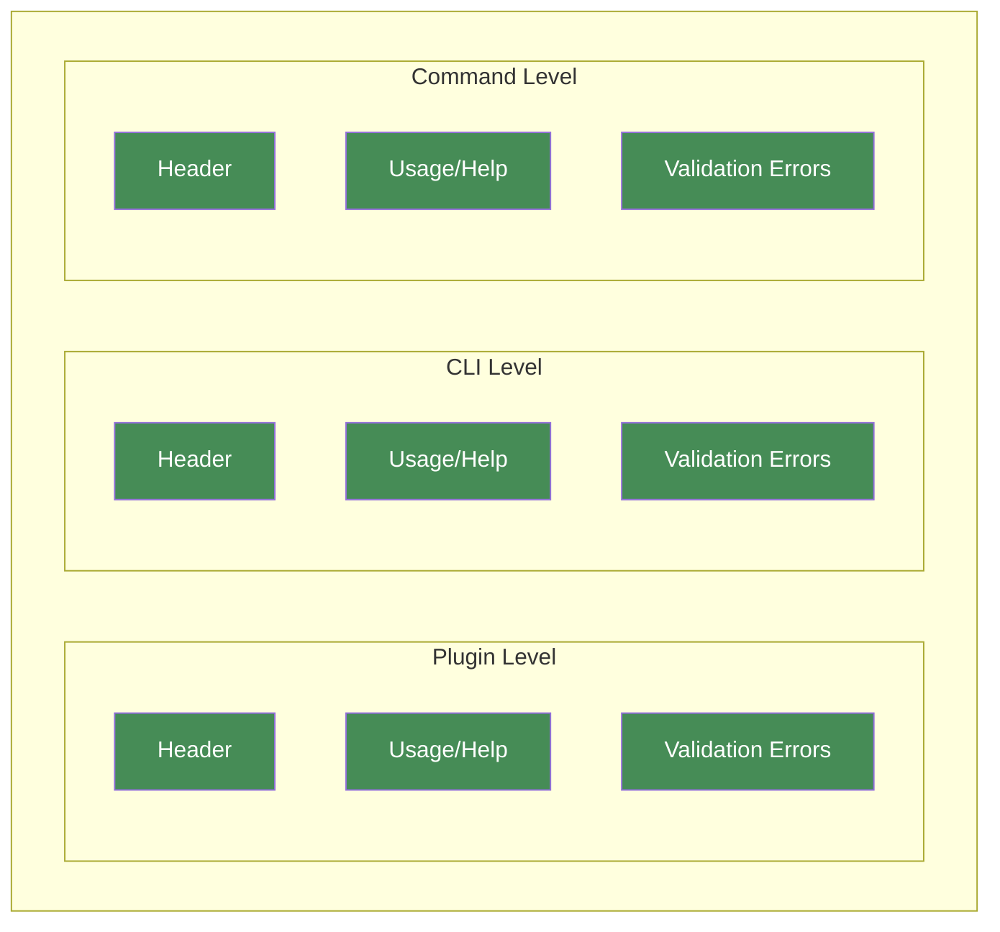
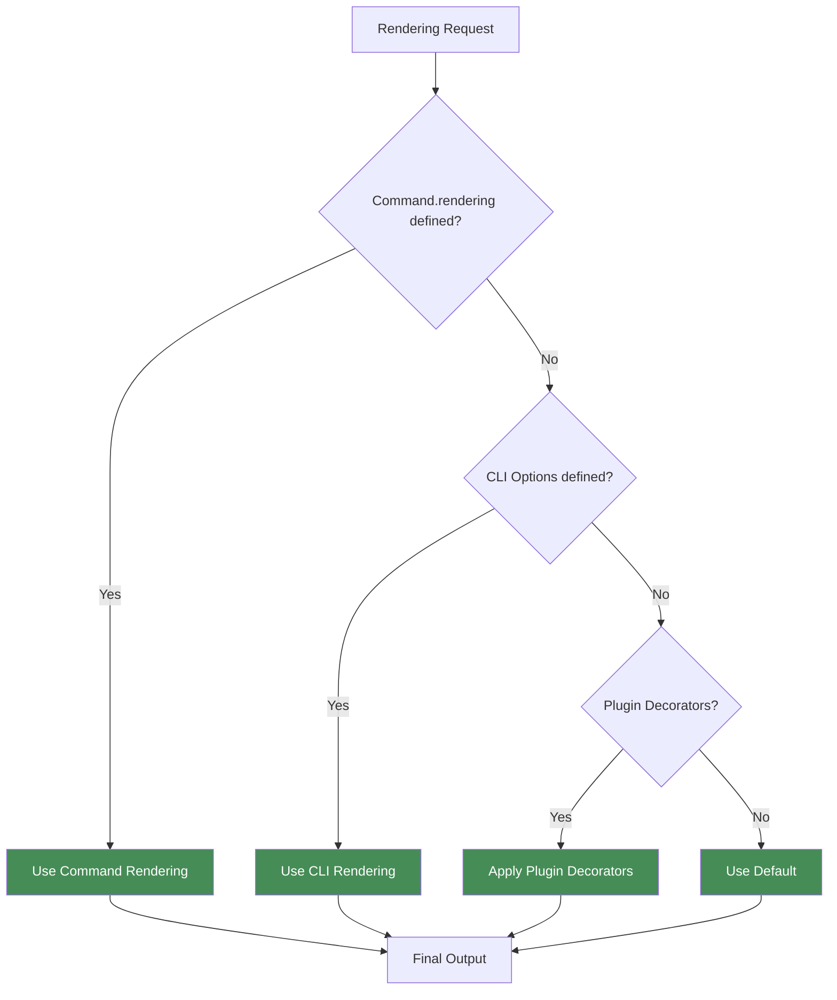
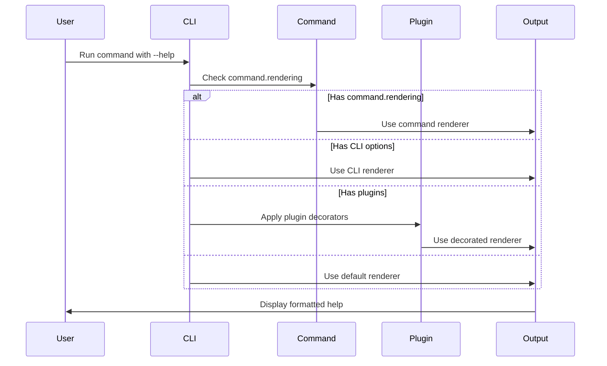

# Rendering Customization

Gunshi provides a flexible rendering system that allows you to customize how your CLI displays help text, usage information, and error messages.

## Overview

Gunshi provides three levels of customization, each capable of controlling all rendering components (Header, Usage/Help, and Validation Errors). When multiple levels define the same renderer, the higher priority level wins:



The diagram above shows that:

- **Command Level** (top) has the highest priority and overrides all other levels
- **CLI Level** (middle) provides defaults for all commands in your application
- **Plugin Level** (bottom) adds reusable rendering logic through decorators

## Renderer Resolution

Gunshi checks each customization level in priority order (Command → CLI → Plugin) and uses the first renderer it finds:



## How It Works

This example shows the rendering resolution flow when a user runs a command with `--help`:



## Command-Level Rendering

The most specific way to customize rendering is at the command level. Use this when:

- A specific command needs unique formatting or branding
- Different commands require different help layouts
- You want to override global settings for particular commands

```ts
import { define } from 'gunshi'

const command = define({
  name: 'watch',
  description: 'Watch files and rebuild on changes',

  // Command-specific rendering for interactive watch mode
  rendering: {
    header: ctx => {
      return `👁️  WATCH MODE - Press Ctrl+C to stop`
    },

    usage: ctx => {
      return `Usage: ${ctx.name} [options]

Watch Options:
  --entry <file>     Entry point (default: src/index.ts)
  --out <dir>        Output directory (default: dist)
  --ignore <pattern> Ignore patterns

Keyboard Shortcuts (during watch):
  r - Force rebuild
  c - Clear console
  q - Quit watch mode`
    },

    validationErrors: (ctx, error) => {
      // Watch-specific error formatting
      return `⚠️  Watch mode cannot start:\n${error.errors.map(err => `   • ${err.message}`).join('\n')}`
    }
  },

  run: async ctx => {
    // Command logic ...
  }
})
```

### Disabling Renderers

Set any renderer to `null` to disable it:

```ts
rendering: {
  header: null,           // No header
  usage: async () => '...' // Custom usage
}
```

## CLI-Level Rendering

Set default renderers for all commands in your CLI. Use this when:

- You want consistent formatting across your entire application
- All commands should share the same branding or style
- You need a baseline that individual commands can override

```ts
import { cli } from 'gunshi'

await cli(process.argv.slice(2), command, {
  name: 'my-cli',
  version: '1.0.0',

  // Apply to all commands
  renderHeader: ctx => {
    return `=== ${ctx.env.name} v${ctx.env.version} ===`
  },

  renderUsage: ctx => {
    return `${ctx.env.name} ${ctx.name || 'command'} [options]`
  },

  renderValidationErrors: (ctx, error) => {
    return `Error: ${error.message}`
  }
})
```

## Plugin-Level Rendering

Plugins can decorate renderers to add consistent behavior across commands. Use this when:

- You want to share rendering logic across multiple projects
- You need to compose rendering behaviors (e.g., colors + i18n)
- You're building reusable CLI components or themes

### Using the Built-in Renderer Plugin

```ts
import { cli } from '@gunshi/bone'
import renderer from '@gunshi/plugin-renderer'

await cli(process.argv.slice(2), command, {
  name: 'my-cli',
  plugins: [
    renderer() // Adds enhanced rendering
  ]
})
```

### Creating a Custom Plugin

> [!IMPORTANT]
> Plugin decorators should call `baseRenderer` to maintain the decorator chain. Other plugins may depend on previous renderers' output, so skipping `baseRenderer` could break the expected behavior.

```ts
import { plugin } from '@gunshi/plugin'

const colorPlugin = plugin({
  id: 'color',
  name: 'Color Plugin',

  setup(context) {
    // Decorate header renderer
    context.decorateHeaderRenderer(async (baseRenderer, ctx) => {
      const output = await baseRenderer(ctx)
      if (!output) {
        return ''
      }

      // Add color (using ANSI codes)
      return `\x1b[36m${output}\x1b[0m`
    })

    // Decorate error renderer
    context.decorateValidationErrorsRenderer(async (baseRenderer, ctx, error) => {
      const output = await baseRenderer(ctx, error)
      if (!output) {
        return ''
      }

      // Make errors red
      return `\x1b[31m${output}\x1b[0m`
    })
  }
})
```

## Next Steps

- Learn about [Command Hooks](./command-hooks.md) for lifecycle control
- Explore [Type System](./type-system.md) for type-safe rendering
- See [Plugin Development](/guide/plugin/getting-started.md) for creating custom plugins
