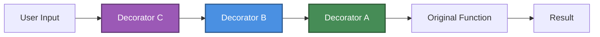
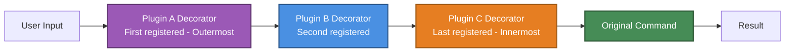

# Plugin Decorators

Decorators are a powerful pattern in Gunshi's plugin system that allows you to wrap and enhance existing functionality. This guide explains how to effectively use decorators in your plugins.

## Understanding the Decorator Pattern

In Gunshi, decorators follow the **LIFO (Last In, First Out)** execution order. This means the last decorator registered is the first to execute, creating a wrapping effect around the original functionality.



Gunshi supports two types of decorators:

- **Command Decorators**: Wrap command execution for cross-cutting concerns like logging, authentication, and error handling
- **Renderer Decorators**: Customize output rendering for headers, usage/help messages, and validation errors

## LIFO Execution Order

Understanding LIFO order is crucial for proper decorator composition. The following code demonstrates the execution flow shown in the diagram above using command decorators, where decorators A, B, and C are registered in sequence but execute in reverse order:

```js [plugin.js]
import { plugin } from 'gunshi/plugin'

export default plugin({
  id: 'my-plugin',
  setup(ctx) {
    // Registered first
    ctx.decorateCommand(runner => async ctx => {
      console.log('Decorator A: before')
      const result = await runner(ctx)
      console.log('Decorator A: after')
      return result
    })

    // Registered second
    ctx.decorateCommand(runner => async ctx => {
      console.log('Decorator B: before')
      const result = await runner(ctx)
      console.log('Decorator B: after')
      return result
    })

    // Registered third (executes first!)
    ctx.decorateCommand(runner => async ctx => {
      console.log('Decorator C: before')
      const result = await runner(ctx)
      console.log('Decorator C: after')
      return result
    })
  }
})
```

Application codes:

```js [index.js]
import { cli } from 'gunshi'
import lifo from './plugin.js'

await cli(
  process.argv.slice(2),
  () => {
    console.log('Original command execution')
  },
  {
    plugins: [lifo]
  }
)
```

Run your application with plugin:

```sh
node index.js
Decorator A: before
Decorator B: before
Decorator C: before
Original command execution
Decorator C: after
Decorator B: after
Decorator A: after
```

## Renderer Decorators

Gunshi provides a powerful API for customizing how your CLI displays information through renderer decorators. These decorators allow you to wrap and enhance the rendering of headers, usage/help messages, and validation errors, enabling consistent styling, branding, and enhanced user experience across your CLI application.

### Understanding Renderer Decorators

Renderer decorators follow the same LIFO principle as command decorators but specifically target the presentation layer of your CLI. Gunshi provides three renderer decorator methods via `PluginContext`:

- **`decorateHeaderRenderer`**: Customizes command headers (title/branding)
- **`decorateUsageRenderer`**: Enhances usage and help message display
- **`decorateValidationErrorsRenderer`**: Formats validation error messages

Each decorator receives the base renderer function and must call it to maintain the decorator chain. This ensures that multiple plugins can cooperatively enhance the output.

### Complete Rendering Customization Example

Here's a comprehensive example showing how to customize all three renderers in a single plugin. This plugin adds branding to headers, appends metadata to usage messages, and enhances error formatting:

```js [plugin.js]
import { plugin } from 'gunshi/plugin'

export default plugin({
  id: 'custom-renderer',
  setup(ctx) {
    // Add branding to header
    ctx.decorateHeaderRenderer(async (baseRenderer, ctx) => {
      const header = await baseRenderer(ctx)
      return `🚀 My CLI v${ctx.env.version}\n${header}`
    })

    // Append timestamp to usage
    ctx.decorateUsageRenderer(async (baseRenderer, ctx) => {
      const usage = await baseRenderer(ctx)
      return `${usage}\n\nGenerated: ${new Date().toISOString()}`
    })

    // Format validation errors with emoji
    ctx.decorateValidationErrorsRenderer(async (baseRenderer, ctx, error) => {
      const errors = await baseRenderer(ctx, error)
      return `❌ Validation Error:\n${errors}`
    })
  }
})
```

Application code:

```js [index.js]
import { cli } from 'gunshi'
import customRenderer from './plugin.js'

await cli(
  process.argv.slice(2),
  {
    name: 'build',
    args: {
      output: { type: 'string', required: true }
    },
    run: ctx => console.log(`Building to ${ctx.values.output}`)
  },
  {
    name: 'my-cli',
    version: '1.0.0',
    plugins: [customRenderer]
  }
)
```

Run with `--help` to see customized output:

```sh
node index.js --help
🚀 My CLI v1.0.0
my-cli (my-cli v1.0.0)

USAGE:
  my-cli <OPTIONS>

OPTIONS:
  -h, --help                 Display this help message
  -v, --version              Display this version
  --output <output>


Generated: 2025-08-15T14:26:43.121Z
```

### Multiple Plugin Decorator Execution Order

When multiple plugins register renderer decorators, they follow the LIFO (Last In, First Out) principle. This is particularly important to understand because Gunshi uses two built-in plugins by default: `@gunshi/plugin-global` (adds --help and --version options) and `@gunshi/plugin-renderer` (provides default rendering). When you add your own plugins, they interact with these default plugins in a specific order.

#### Plugin Registration and Execution Order

The following diagram shows how plugins are registered versus how their decorators are executed:

```mermaid
graph TD
    subgraph "Plugin Registration Order"
        R1[1 plugin-global<br/>Command Decorator]
        R2[2 plugin-renderer<br/>Renderer Decorators]
        R3[3 custom-plugin-A<br/>Renderer Decorator]
        R4[4 custom-plugin-B<br/>Renderer Decorator]
        R1 --> R2 --> R3 --> R4
    end

    subgraph "Renderer Decorator Order"
        E1[custom-plugin-B decorator]
        E2[custom-plugin-A decorator]
        E3[plugin-renderer decorator]
        E4[Base Renderer]
        E1 --> E2 --> E3 --> E4
    end

    style R1 fill:#9B59B6,stroke:#633974,stroke-width:2px,color:#fff
    style R2 fill:#4A90E2,stroke:#2E5A8E,stroke-width:2px,color:#fff
    style R3 fill:#E67E22,stroke:#A35D18,stroke-width:2px,color:#fff
    style R4 fill:#E67E22,stroke:#A35D18,stroke-width:2px,color:#fff
    style E1 fill:#E67E22,stroke:#A35D18,stroke-width:2px,color:#fff
    style E2 fill:#E67E22,stroke:#A35D18,stroke-width:2px,color:#fff
    style E3 fill:#4A90E2,stroke:#2E5A8E,stroke-width:2px,color:#fff
    style E4 fill:#468c56,stroke:#2e5936,stroke-width:2px,color:#fff
```



#### How Default and Custom Plugins Interact

Here's an example showing how the default Gunshi plugins work together with custom plugins:

custom-plugin-A:

```js [plugin-a.js]
import { plugin } from 'gunshi/plugin'

export default plugin({
  id: 'custom-a',
  setup(ctx) {
    ctx.decorateUsageRenderer(async (baseRenderer, ctx) => {
      const usage = await baseRenderer(ctx) // Call next decorator first
      console.log('[custom-a] Decorating usage')
      return `${usage}\n📦 Enhanced by Plugin A`
    })
  }
})
```

custom-plugin-B:

```js [plugin-b.js]
import { plugin } from 'gunshi/plugin'

export default plugin({
  id: 'custom-b',
  setup(ctx) {
    ctx.decorateUsageRenderer(async (baseRenderer, ctx) => {
      const usage = await baseRenderer(ctx) // Call next decorator first
      console.log('[custom-b] Decorating usage')
      return `${usage}\n🎨 Styled by Plugin B`
    })
  }
})
```

```js [index.js]
import { cli } from 'gunshi' // Includes plugin-global and plugin-renderer by default
import pluginA from './plugin-a.js'
import pluginB from './plugin-b.js'

await cli(
  process.argv.slice(2),
  {
    name: 'demo',
    run: () => console.log('Demo command')
  },
  {
    name: 'my-cli',
    version: '1.0.0',
    renderHeader: null, // Disable default header rendering
    // Custom plugins are added after default plugins
    plugins: [pluginA, pluginB]
  }
)
```

#### Execution Flow Breakdown

When you run `node index.js --help`, two different types of decorators work together:

**1. Command Decorator (`@gunshi/plugin-global`):**

- Intercepts the `--help` option
- Calls the renderer functions to generate output

**2. Renderer Decorators (LIFO wrapping, depth-first execution):**

- **Wrapping order (LIFO):** custom-plugin-B wraps custom-plugin-A wraps plugin-renderer wraps base
- **Execution flow:**
  1. custom-plugin-B decorator starts → calls `baseRenderer` first
  2. custom-plugin-A decorator starts → calls `baseRenderer` first
  3. plugin-renderer decorator executes → returns full usage
  4. custom-plugin-A continues → logs and adds "📦 Enhanced by Plugin A"
  5. custom-plugin-B continues → logs and adds "🎨 Styled by Plugin B"

The console output would show:

```sh
[custom-a] Decorating usage    // Logs after calling its baseRenderer
[custom-b] Decorating usage    // Logs after calling its baseRenderer
```

And the final rendered output:

```sh
Usage: demo [options]

Options:
  --help     Show help
  --version  Show version

📦 Enhanced by Plugin A
🎨 Styled by Plugin B
```

#### Understanding the Chain

The renderer decorator chain works differently than you might expect:

```js
// Actual execution flow for renderer decorators
const base = await baseRenderer(ctx) // Returns ""
const afterRenderer = await rendererDecorator(base, ctx) // Ignores base, returns full usage
const afterCustomA = await customADecorator(afterRenderer, ctx) // Adds "Enhanced by Plugin A"
const final = await customBDecorator(afterCustomA, ctx) // Adds "Styled by Plugin B"
```

> [!NOTE]
> `@gunshi/plugin-global` uses a **command decorator** to handle `--help`/`--version` options, while `@gunshi/plugin-renderer` uses **renderer decorators** to format the output. The base renderer returns an empty string, and `@gunshi/plugin-renderer` provides the actual implementation.

> [!IMPORTANT]
> Always call `baseRenderer` in your decorator to maintain the decorator chain. While `@gunshi/plugin-renderer` replaces the empty base renderer with full implementation, your custom decorators should enhance the output from previous decorators in the chain.

### Important Considerations

**Always call `baseRenderer` in your decorator to maintain the decorator chain. Skipping it will break other plugins that may depend on the output.**

> [!NOTE]
> Renderer decorators have the lowest priority in Gunshi's rendering system. Command-level and CLI-level renderers will override plugin decorators. See [Rendering Customization](../advanced/rendering-customization.md) for details on renderer priority.

## Command Decorators

Command decorators wrap the actual command execution logic, allowing plugins to intercept, modify, or enhance command behavior. Unlike renderer decorators that only affect output formatting, command decorators can control the entire execution flow, including validation, authentication, logging, and error handling.

### Understanding Command Decorators

Command decorators use the `decorateCommand()` method provided by the `PluginContext`. Each decorator receives a runner function (the next decorator or original command) and returns a new function that wraps it:

```js
ctx.decorateCommand(runner => async ctx => {
  // Pre-execution logic
  console.log('Before command')

  // Call the next decorator or original command
  const result = await runner(ctx)

  // Post-execution logic
  console.log('After command')

  return result
})
```

### Command Decorator Execution Order

Command decorators follow a specific execution pattern. When multiple decorators are registered, `reduceRight` processes them from last to first, but this creates a wrapper structure where the first registered decorator becomes the outermost layer:



### Basic Command Decorator Example

Here's a complete example demonstrating how multiple command decorators work together:

```js [plugin.js]
import { plugin } from 'gunshi/plugin'

const sleep = ms => new Promise(resolve => setTimeout(resolve, ms))

export default plugin({
  id: 'multi-decorator',
  setup(ctx) {
    // First decorator: Logging
    ctx.decorateCommand(runner => async ctx => {
      console.log('[LOG] Command started:', ctx.name)
      const result = await runner(ctx)
      console.log('[LOG] Command completed')
      return result
    })

    // Second decorator: Timing
    ctx.decorateCommand(runner => async ctx => {
      const start = Date.now()
      await sleep(10)
      const result = await runner(ctx)
      console.log(`[TIME] Execution: ${Date.now() - start}ms`)
      return result
    })

    // Third decorator: Error wrapper
    ctx.decorateCommand(runner => async ctx => {
      try {
        console.log('[ERROR] Monitoring enabled')
        return await runner(ctx)
      } catch (error) {
        console.error('[ERROR] Command failed:', error.message)
        throw error
      }
    })
  }
})
```

```js [index.js]
import { cli } from 'gunshi'
import multi from './plugin.js'

const command = {
  name: 'process',
  run: ctx => {
    console.log('>>> Executing actual command <<<')
    return 'Command result'
  }
}

await cli(process.argv.slice(2), command, {
  plugins: [multi]
})
```

Running `node index.js` outputs:

```sh
[LOG] Command started: process
[ERROR] Monitoring enabled
>>> Executing actual command <<<
[TIME] Execution: 11ms
[LOG] Command completed
```

### Command Decorator vs Renderer Decorator

Understanding the difference between these two decorator types is crucial:

| Aspect         | Command Decorator                  | Renderer Decorator                      |
| -------------- | ---------------------------------- | --------------------------------------- |
| **Purpose**    | Wraps command execution            | Wraps output rendering                  |
| **Method**     | `ctx.decorateCommand()`            | `ctx.decorateUsageRenderer()`, etc.     |
| **Can modify** | Command behavior, flow control     | Output formatting only                  |
| **Can access** | Full CommandContext                | CommandContext + render-specific params |
| **Use cases**  | Auth, logging, validation, caching | Styling, i18n, branding                 |

> [!NOTE]
> The `@gunshi/plugin-global` plugin uses a command decorator to intercept `--help` and `--version` options, preventing normal command execution and triggering rendering instead.

## Next Steps

- Learn about [Plugin Extensions](./extensions.md) for plugin communication
- Understand [Plugin Types](./types.md) for type-safe decorators
- Explore [Official Plugins](./official-plugins.md) for decorator examples
