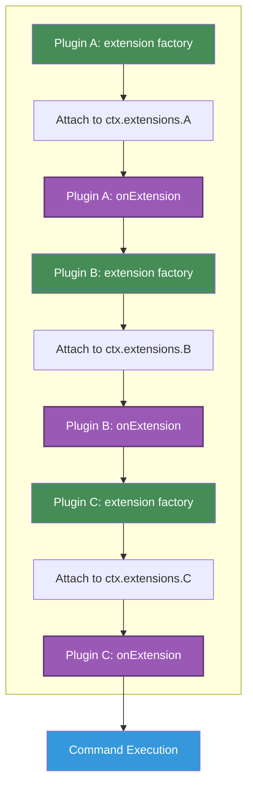

# Plugin Extensions

Extensions are the primary mechanism for plugins to add functionality to the command context.

This guide explains how to create and use plugin extensions for type-safe inter-plugin communication.

## What are Extensions?

Extensions allow plugins to inject custom functionality into the `CommandContext` that becomes available to all commands and other plugins.

Each extension is namespaced by the plugin ID to prevent conflicts.

Here's a simple example showing the concept:

```js
import { plugin } from 'gunshi/plugin'
import { define } from 'gunshi'

// Plugin provides an extension
const loggerPlugin = plugin({
  id: 'logger',
  extension: () => ({
    log: msg => console.log(msg),
    error: msg => console.error(msg)
  })
})

// Commands can use the extension
const command = define({
  name: 'deploy',
  run: ctx => {
    // Access extension via plugin ID
    ctx.extensions.logger.log('Starting deployment...')
  }
})
```

Extensions enable:

- **Shared Functionality**: Provide common utilities (logging, caching, database access)
- **Plugin Composition**: Build plugins that work together
- **Type Safety**: Define clear contracts between plugins
- **State Management**: Maintain state across command execution

> [!NOTE]
> For advanced type safety patterns and type-safe plugin communication, see the [Plugin Type System](./type-system.md) guide.

## Extension Lifecycle

Understanding when and how extensions are created is crucial for effective plugin development.

### Lifecycle Phases

> [!NOTE]
> The steps mentioned below (H, I) refer to the complete CLI execution lifecycle documented in the [Plugin Lifecycle](./lifecycle.md) guide. Extensions are involved in the Execution Phase, which occurs after plugins are loaded and configured during the Setup Phase.

During command execution, extensions go through three distinct phases:

1. **Extension Creation (Step H)**: The `extension` factory function is called to create each plugin's extension
2. **Post-Extension Hook (Step H)**: The `onExtension` callback is executed after all extensions are created
3. **Command Execution (Step I)**: The actual command runs with all extensions available

The following diagram illustrates the relationship between `extension` and `onExtension`:

<h5 style="text-align: center; padding: 1em; margin: 1em">Plugin Processing (in dependency order)</h5>



### Execution Order Guarantees

Gunshi processes plugins sequentially in dependency order, ensuring dependencies are always resolved before dependents:

1. **Plugins are sorted by dependencies** - Dependencies are processed before plugins that depend on them
2. **For each plugin in order**:
   a. The plugin's `extension` factory is called
   b. The extension result is immediately attached to `ctx.extensions[pluginId]`
   c. The plugin's `onExtension` callback runs (if defined) with access to its own extension and all dependency extensions
3. **Command execution** - The command executes only after all plugins have been processed

This ensures that:

- When a plugin's `onExtension` runs, it has access to:
  - Its own extension (just created)
  - All dependency extensions (already processed)
- Dependencies are always initialized before dependents
- The execution order respects the dependency graph
- Commands have a fully initialized context with all extensions

> [!IMPORTANT]
> A plugin's `onExtension` callback does NOT have access to extensions from plugins that depend on it, as those are processed later in the sequence.

## Creating Extensions

> [!TIP]
> **It's strongly recommended to define your extension interfaces using TypeScript.** This benefits all users: end users get IDE autocompletion and compile-time error detection when using your extension, plugin users receive type safety guarantees, and other plugin developers can build on top of your plugin with confidence.

### The `extension` Factory

The `extension` factory function is called during Step H to create an extension object that becomes available through `ctx.extensions`. This is where you can:

- Create fresh instances for each command execution
- Access parsed arguments and command information
- Access extensions from dependent plugins
- Initialize resources synchronously or asynchronously
- Return methods and properties for other plugins and commands to use

```ts [metrics.ts]
import { plugin } from 'gunshi/plugin'

export default plugin({
  id: 'metrics',

  extension: (ctx, cmd) => {
    // Called during Step H: Create Extensions
    // Fresh instance for each command execution

    const startTime = Date.now()
    const commandName = cmd.name || 'root'

    // Access parsed command-line arguments
    const verbose = ctx.values.verbose === true

    // Return the extension object (can be sync or async)
    return {
      recordMetric: (name: string, value: number) => {
        if (verbose) {
          console.log(`[${commandName}] ${name}: ${value}`)
        }
      },
      getElapsedTime: () => Date.now() - startTime
    }
  }
})
```

### The `onExtension` Hook

The `onExtension` callback runs after all extensions are created and attached to the context. This is where you can:

- Access your own extension via `ctx.extensions`
- Interact with other plugin extensions
- Perform initialization that depends on the complete context
- Set up resources needed before command execution

```ts [database.ts]
import { plugin } from 'gunshi/plugin'

export default plugin({
  id: 'database',
  dependencies: [
    { id: 'logger', optional: true } // Optional dependency
  ],

  extension: () => {
    // Create the extension object
    const pool = createPool()

    return {
      query: (sql: string) => pool.query(sql),
      connect: () => pool.connect(),
      disconnect: () => pool.disconnect()
    }
  },

  onExtension: async (ctx, cmd) => {
    // Called during Step H: Execute onExtension
    // All extensions are now available

    // Access your own extension
    const db = ctx.extensions.database

    // Interact with other extensions if available
    // Note: ctx.extensions.logger is only available here if the logger plugin
    // was processed before this plugin (as a dependency or earlier in registration)
    if (ctx.extensions.logger) {
      ctx.extensions.logger.log('Database plugin initialized')
    }

    // Perform command-specific initialization
    if (cmd.name === 'migrate' || cmd.name === 'seed') {
      await db.connect()

      if (ctx.extensions.logger) {
        ctx.extensions.logger.log('Database connected')
      }
    }
  }
})
```

### Basic Extension

Start with a simple extension that provides basic functionality:

```ts [logger.ts]
import { plugin } from 'gunshi/plugin'

// Define the extension interface
export interface LoggerExtension {
  log: (message: string) => void
  error: (message: string) => void
  warn: (message: string) => void
  debug: (message: string) => void
}

// Export for other plugins to use
export const pluginId = 'logger' as const
export type PluginId = typeof pluginId

// Implement the extension
export default plugin({
  id: pluginId,
  extension: (): LoggerExtension => ({
    log: msg => console.log(msg),
    error: msg => console.error(msg),
    warn: msg => console.warn(msg),
    debug: msg => console.debug(msg)
  })
})
```

### Using Command Context and Parameters

Extensions can access the `ctx` and `cmd` parameters to adapt their behavior based on command-line arguments and command configuration:

```ts [cache.ts]
import { plugin } from 'gunshi/plugin'

export interface CacheExtension {
  get: <T>(key: string) => T | undefined
  set: <T>(key: string, value: T) => void
  clear: () => void
  size: () => number
}

export default plugin({
  id: 'cache',

  extension: (ctx, cmd) => {
    // Create command-specific cache
    const cache = new Map<string, unknown>()
    const commandName = cmd.name || 'global'
    const debug = ctx.values.debug === true

    return {
      get: <T>(key: string): T | undefined => {
        const value = cache.get(key) as T | undefined
        if (debug && value !== undefined) {
          console.log(`[${commandName}] Cache hit: ${key}`)
        }
        return value
      },

      set: <T>(key: string, value: T) => {
        cache.set(key, value)
        if (debug) {
          console.log(`[${commandName}] Cache set: ${key}`)
        }
      },

      clear: () => cache.clear(),
      size: () => cache.size
    }
  }
})
```

> [!TIP]
> The example fully code is [here](https://github.com/kazupon/gunshi/tree/main/playground/plugins/extensions).

## Next Steps

You've mastered extensions—the powerful mechanism for sharing functionality between plugins and commands. With extensions, your plugins can provide APIs, services, and utilities that enhance the entire CLI ecosystem.

Now it's time to ensure your plugins are type-safe. The next chapter, [Plugin Type System](./type-system.md), will show you how to leverage TypeScript's type system to create plugins with compile-time safety and excellent IDE support.
