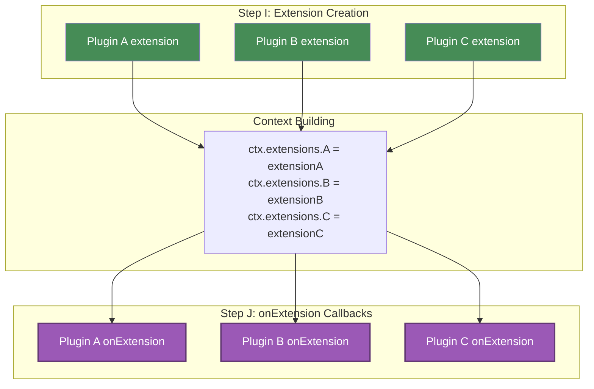

# Plugin Extensions

Extensions are the primary mechanism for plugins to add functionality to the command context. This guide explains how to create and use plugin extensions for type-safe inter-plugin communication.

## What are Extensions?

Extensions allow plugins to inject custom functionality into the `CommandContext` that becomes available to all commands and other plugins. Each extension is namespaced by the plugin ID to prevent conflicts.

Here's a simple example showing the concept:

```js
// Plugin provides an extension
const loggerPlugin = plugin({
  id: 'logger',
  extension: () => ({
    log: msg => console.log(msg),
    error: msg => console.error(msg)
  })
})

// Commands can use the extension
const command = define({
  name: 'deploy',
  run: ctx => {
    // Access extension via plugin ID
    ctx.extensions.logger.log('Starting deployment...')
  }
})
```

Extensions enable:

- **Shared Functionality**: Provide common utilities (logging, caching, database access)
- **Plugin Composition**: Build plugins that work together
- **Type Safety**: Define clear contracts between plugins
- **State Management**: Maintain state across command execution

> [!NOTE]
> For advanced type safety patterns and type-safe plugin communication, see the [Plugin Type System](./type-system.md) guide.

## Extension Lifecycle

Understanding when and how extensions are created is crucial for effective plugin development.

### Lifecycle Phases

> [!NOTE]
> The steps mentioned below (I, J, K) refer to the complete CLI execution lifecycle documented in the [Plugin Lifecycle](./lifecycle.md) guide. Extensions are involved in the Execution Phase, which occurs after plugins are loaded and configured during the Setup Phase.

During command execution, extensions go through three distinct phases:

1. **Extension Creation (Step I)**: The `extension` factory function is called to create each plugin's extension
2. **Post-Extension Hook (Step J)**: The `onExtension` callback is executed after all extensions are created
3. **Command Execution (Step K)**: The actual command runs with all extensions available

The following diagram illustrates the relationship between `extension` and `onExtension`:



### Execution Order Guarantees

Gunshi guarantees the following execution order:

1. **All extensions are created first** (Step I) - All `extension` factories are called in dependency order
2. **Extensions are attached to context** - All extensions are attached to `ctx.extensions` before any `onExtension` runs
3. **All `onExtension` callbacks run** (Step J) - Callbacks execute in dependency order with full context available
4. **Command execution** (Step K) - The command executes only after all `onExtension` callbacks complete

This ensures that:

- Extensions can safely access other extensions in `onExtension`
- Dependencies are respected in both creation and callback order
- Initialization happens in the correct order
- Commands have a fully initialized context
- When `onExtension` runs, all plugin extensions (including dependencies) are available through `ctx.extensions`

## Creating Extensions

> [!TIP]
> **It's strongly recommended to define your extension interfaces using TypeScript.** This benefits all users: end users get IDE autocompletion and compile-time error detection when using your extension, plugin users receive type safety guarantees, and other plugin developers can build on top of your plugin with confidence.

### The `extension` Factory

The `extension` factory function is called during Step I to create an extension object that becomes available through `ctx.extensions`. This is where you can:

- Create fresh instances for each command execution
- Access parsed arguments and command information
- Access extensions from dependent plugins
- Initialize resources synchronously or asynchronously
- Return methods and properties for other plugins and commands to use

```ts [metrics.ts]
import { plugin } from 'gunshi/plugin'

export default plugin({
  id: 'metrics',

  extension: (ctx, cmd) => {
    // Called during Step I: Create Extensions
    // Fresh instance for each command execution

    const startTime = Date.now()
    const commandName = cmd.name || 'root'

    // Access parsed command-line arguments
    const verbose = ctx.values.verbose === true

    // Return the extension object (can be sync or async)
    return {
      recordMetric: (name: string, value: number) => {
        if (verbose) {
          console.log(`[${commandName}] ${name}: ${value}`)
        }
      },
      getElapsedTime: () => Date.now() - startTime
    }
  }
})
```

### The `onExtension` Hook

The `onExtension` callback runs after all extensions are created and attached to the context. This is where you can:

- Access your own extension via `ctx.extensions`
- Interact with other plugin extensions
- Perform initialization that depends on the complete context
- Set up resources needed before command execution

```ts [database.ts]
import { plugin } from 'gunshi/plugin'

export default plugin({
  id: 'database',
  dependencies: [
    { id: 'logger', optional: true } // Optional dependency
  ],

  extension: () => {
    // Create the extension object
    const pool = createPool()

    return {
      query: (sql: string) => pool.query(sql),
      connect: () => pool.connect(),
      disconnect: () => pool.disconnect()
    }
  },

  onExtension: async (ctx, cmd) => {
    // Called during Step J: Execute onExtension
    // All extensions are now available

    // Access your own extension
    const db = ctx.extensions.database

    // Interact with other extensions if available
    if (ctx.extensions.logger) {
      ctx.extensions.logger.log('Database plugin initialized')
    }

    // Perform command-specific initialization
    if (cmd.name === 'migrate' || cmd.name === 'seed') {
      await db.connect()

      if (ctx.extensions.logger) {
        ctx.extensions.logger.log('Database connected')
      }
    }
  }
})
```

### Basic Extension

Start with a simple extension that provides basic functionality:

```ts [logger.ts]
import { plugin } from 'gunshi/plugin'

// Define the extension interface
export interface LoggerExtension {
  log: (message: string) => void
  error: (message: string) => void
  warn: (message: string) => void
  debug: (message: string) => void
}

// Export for other plugins to use
export const pluginId = 'logger' as const
export type PluginId = typeof pluginId

// Implement the extension
export default plugin({
  id: pluginId,
  extension: (): LoggerExtension => ({
    log: msg => console.log(msg),
    error: msg => console.error(msg),
    warn: msg => console.warn(msg),
    debug: msg => console.debug(msg)
  })
})
```

### Using Command Context and Parameters

Extensions can access the `ctx` and `cmd` parameters to adapt their behavior based on command-line arguments and command configuration:

```ts [cache.ts]
import { plugin } from 'gunshi/plugin'

export interface CacheExtension {
  get: <T>(key: string) => T | undefined
  set: <T>(key: string, value: T) => void
  clear: () => void
  size: () => number
}

export default plugin({
  id: 'cache',

  extension: (ctx, cmd) => {
    // Create command-specific cache
    const cache = new Map<string, unknown>()
    const commandName = cmd.name || 'global'
    const debug = ctx.values.debug === true

    return {
      get: <T>(key: string): T | undefined => {
        const value = cache.get(key) as T | undefined
        if (debug && value !== undefined) {
          console.log(`[${commandName}] Cache hit: ${key}`)
        }
        return value
      },

      set: <T>(key: string, value: T) => {
        cache.set(key, value)
        if (debug) {
          console.log(`[${commandName}] Cache set: ${key}`)
        }
      },

      clear: () => cache.clear(),
      size: () => cache.size
    }
  }
})
```

## Next Steps

- Learn about [Plugin Type System](./type-system.md) for advanced type safety
- Explore [Plugin Testing](./testing.md) strategies
- Review [Guidelines](./guidelines.md) for extension lifecycle management
- See [Official Plugins](./official-plugins.md) for real-world extension examples
- Study the [i18n plugin implementation](https://github.com/kazupon/gunshi/blob/main/packages/plugin-i18n/src/index.ts) for an example of using the `onExtension` hook effectively
