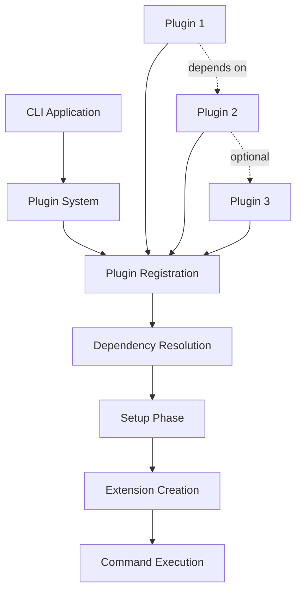

# Plugin System Introduction

Gunshi's plugin system is a powerful feature that enables you to extend your CLI applications with reusable functionality, type-safe interfaces, and composable behaviors.

This comprehensive system allows you to build modular, maintainable, and extensible command-line tools.

## Why Plugins?

The plugin system addresses several key challenges in CLI development:

### 1. Separation of Concerns

Plugins allow you to separate core command logic from cross-cutting concerns like logging, authentication, database connections, and rendering.

This separation makes your code more organized and easier to maintain.

### 2. Reusability

Once you create a plugin, you can reuse it across multiple commands and even different CLI applications.

This reduces code duplication and development time.

### 3. Type Safety

Gunshi's plugin system is built with TypeScript-first design, providing full type safety for plugin extensions and their interactions.

You get compile-time validation and IntelliSense support throughout your development.

### 4. Ecosystem

The plugin architecture enables a rich ecosystem where developers can share and compose plugins.

Official plugins provide common functionality, while you can create custom plugins for your specific needs.

## Plugin System Concepts

### Plugin Philosophy

Gunshi plugins follow these core principles:

- **Composability**: Plugins can be combined and work together seamlessly
- **Type Safety**: Full TypeScript support with compile-time validation
- **Lifecycle Awareness**: Plugins integrate at specific points in the CLI lifecycle
- **Dependency Management**: Automatic resolution of plugin dependencies
- **Extension Pattern**: Plugins extend command contexts with new capabilities

### Plugin Architecture



This diagram illustrates the plugin system's execution flow.

When a CLI application starts, plugins are registered and their dependencies are resolved. During the setup phase, each plugin's initialization code runs.

Extensions are then created and made available to commands during execution.

Plugins can depend on each other (solid lines) or have optional dependencies (dotted lines).

## Package vs Entry Point

Gunshi provides two ways to work with plugins:

### Package: `@gunshi/plugin`

The `@gunshi/plugin` package is a complete plugin development kit:

::: code-group

```sh [npm]
npm install --save @gunshi/plugin
```

```sh [pnpm]
pnpm add @gunshi/plugin
```

```sh [yarn]
yarn add @gunshi/plugin
```

```sh [deno]
deno add jsr:@gunshi/plugin
```

```sh [bun]
bun add @gunshi/plugin
```

:::

Use this package when:

- Building standalone plugin packages
- Creating plugins with complex type definitions
- Developing plugins for distribution
- Need access to all plugin utilities and types

```ts
// Using the package for plugin development
import { plugin } from '@gunshi/plugin'
import type { PluginContext } from '@gunshi/plugin'

export default function myPlugin() {
  return plugin({
    id: 'my-plugin',
    setup: (ctx: PluginContext) => {
      // Plugin implementation
    }
  })
}
```

### Entry Point: `gunshi/plugin`

The `gunshi/plugin` entry point provides essential plugin functionality:

```js
// Using the entry point for simple plugins
import { plugin } from 'gunshi/plugin'

export default plugin({
  id: 'simple',
  setup: ctx => {
    // Simple plugin logic
  }
})
```

Use the entry point when:

- Creating simple, application-specific plugins
- Building inline plugins within your CLI
- Want to minimize external dependencies

## Plugin Ecosystem Overview

### Official Plugins

Gunshi provides several official plugins that cover common CLI needs:

#### Core Plugins (Built-in)

- **`@gunshi/plugin-global`**: Adds `--help`, `--version` options, version, header, usage and validation errors rendering helpers
- **`@gunshi/plugin-renderer`**: Provides usage and help core renderer

#### Optional Plugins

- **`@gunshi/plugin-i18n`**: Internationalization support
- **`@gunshi/plugin-completion`**: Shell completion functionality

### Community Plugins

The plugin architecture enables the community to create and share plugins.

### Custom Plugins

You can create custom plugins tailored to your specific needs:

```ts
// Domain-specific plugin for your application
export default plugin({
  id: 'api',
  extension: () => ({
    client: new ApiClient(),
    authenticate: async (token: string) => {
      // Custom authentication logic
    }
  })
})
```

## Plugin Capabilities

### 1. Add Global Options

Plugins can register global options that will be available to all commands:

```js
setup: ctx => {
  ctx.addGlobalOption('debug', {
    type: 'boolean',
    description: 'Enable debug mode'
  })
}
```

### 2. Register Sub-Commands

Plugins can dynamically register new sub-commands during the setup phase:

```js
setup: ctx => {
  ctx.addCommand('plugin-command', {
    name: 'plugin-command',
    run: ctx => console.log('Plugin command executed')
  })
}
```

### 3. Decorate Renderers

Plugins can enhance or modify the built-in renderers to customize output:

```js
setup: ctx => {
  ctx.decorateUsageRenderer(async (baseRenderer, ctx) => {
    const base = await baseRenderer(ctx)
    return `${base}\n\nEnhanced by plugin`
  })
}
```

### 4. Extend Command Context

Plugins can extend the `CommandContext` with additional functionality that commands can access:

```js
extension: () => ({
  database: new Database(),
  cache: new Cache(),
  logger: new Logger()
})
```

### 5. Intercept Command Execution

Plugins can intercept and modify command execution using decorators:

```js
setup: ctx => {
  ctx.decorateCommand(baseRunner => async ctx => {
    console.log('Before command')
    const result = await baseRunner(ctx)
    console.log('After command')
    return result
  })
}
```

## Getting Started

To start using plugins in your Gunshi CLI:

1. **Use Built-in Plugins**: The default `cli` function includes essential plugins
2. **Add Official Plugins**: Install and configure official plugins as needed
3. **Create Custom Plugins**: Build plugins specific to your application
4. **Share Plugins**: Publish reusable plugins for the community

The following is an example of code for installing the official `@gunshi/plugin-i18n` and application-specific plugins:

```js
import { cli } from 'gunshi'
import i18n from '@gunshi/plugin-i18n'
import custom from './plugins/custom.js'

const entry = ctx => {}

await cli(args, entry, {
  plugins: [i18n({ locale: 'en-US' }), custom()]
})
```

## Next Steps

Now that you understand what plugins are and how they enhance Gunshi CLIs, it's time to start building your own plugins.

The plugin development learning journey follows a progression:

- **[Getting Started](./getting-started.md)** - Create your first plugin with simple examples and learn the basic plugin structure
- **[Plugin Lifecycle](./lifecycle.md)** - Understand when and how plugins execute during CLI runtime
- **[Plugin Dependencies](./dependencies.md)** - Build plugin ecosystems with proper dependency management
- **[Plugin Decorators](./decorators.md)** - Wrap and enhance existing functionality with decorators
- **[Plugin Extensions](./extensions.md)** - Share features across commands through context extensions
- **[Plugin Type System](./type-system.md)** - Ensure type safety throughout your plugin implementation
- **[Plugin Testing](./testing.md)** - Write comprehensive tests for your plugins
- **[Plugin Development Guidelines](./guidelines.md)** - Follow production-ready patterns and conventions
- **[Plugin List](./list.md)** - Explore official and community plugins

Start with [Getting Started](./getting-started.md) to create your first plugin and experience the plugin development workflow firsthand.
