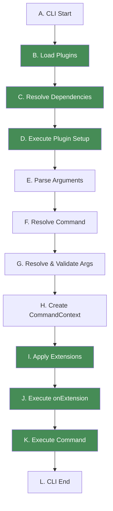
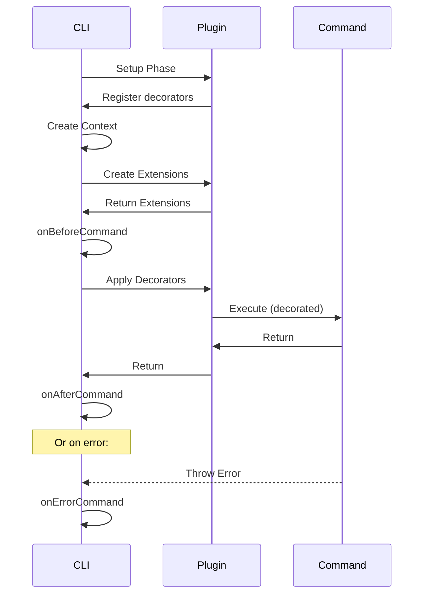

# Plugin Lifecycle

Understanding the Gunshi lifecycle is crucial for effective plugin development. This guide explains how plugins integrate with the CLI execution flow and when different plugin features are activated.

## CLI Execution Lifecycle

When a Gunshi CLI application runs, it follows a specific sequence of steps from startup to completion. The diagram below shows the complete execution flow, with plugin-related steps highlighted in green:



The lifecycle consists of 12 steps (A through L), where plugins are primarily involved in:

- **Steps B-D**: Plugin initialization and setup
- **Steps I-J**: Plugin extension creation and activation
- **Step K**: Command execution with plugin decorators applied

## Plugin-Specific Lifecycle Steps

Plugins are primarily involved in specific steps of the CLI lifecycle. This section focuses on the steps where plugins actively participate.

### Setup Phase (Steps B-D)

During the setup phase, plugins are loaded, dependencies are resolved, and plugin setup functions are executed. This phase occurs once at CLI initialization.

**What happens in this phase:**

- Plugins configure the CLI by adding options, commands, and decorators
- All modifications are registered but not yet executed
- The `setup()` function runs for each plugin

#### Step B: Load Plugins

Plugins are collected from CLI options and prepared for initialization.

The following code shows how plugins are passed to the CLI function:

```js
await cli(args, command, {
  plugins: [
    plugin1(), // Collected
    plugin2(), // Collected
    plugin3() // Collected
  ]
})
```

#### Step C: Resolve Dependencies

Gunshi uses **topological sorting** to resolve plugin dependencies.

The following example demonstrates how plugins with dependencies are resolved in the correct order:

```js
// Given these plugins:
const pluginA = plugin({
  id: 'a',
  dependencies: ['b', 'c']
})

const pluginB = plugin({
  id: 'b',
  dependencies: ['d']
})

const pluginC = plugin({
  id: 'c'
})

const pluginD = plugin({
  id: 'd'
})

// Resolution order: d → b → c → a
```

> [!TIP]
> For a comprehensive guide on plugin dependency resolution, including circular dependency detection, optional dependencies, see [Plugin Dependencies](./dependencies.md).

#### Step D: Execute Plugin Setup

The `setup` function of each plugin is called in dependency order.

This example shows what actions a plugin can perform during setup:

```js
const myPlugin = plugin({
  id: 'my-plugin',
  setup: ctx => {
    // This runs during Setup Phase
    console.log('Plugin setting up')

    // Add global options
    ctx.addGlobalOption('verbose', {
      type: 'boolean',
      description: 'Verbose output'
    })

    // Register sub-commands
    ctx.addCommand('plugin-cmd', {
      name: 'plugin-cmd',
      run: ctx => console.log('Plugin command')
    })

    // Add decorators (they stack in LIFO order)
    ctx.decorateCommand(baseRunner => async ctx => {
      console.log('Before command (from plugin)')
      const result = await baseRunner(ctx)
      console.log('After command (from plugin)')
      return result
    })
  }
})
```

### Command Processing (Steps E-H)

Between the setup phase and execution phase, Gunshi processes the command-line arguments and prepares the execution context:

- **Step E**: Parse command-line arguments into structured tokens
- **Step F**: Resolve which command to execute
- **Step G**: Validate arguments against the command's schema
- **Step H**: Create the CommandContext object

> [!NOTE]
> These internal processing steps are handled automatically by Gunshi. Plugin developers don't need to interact with these steps directly.

### Execution Phase (Steps I-K)

During the execution phase, plugin extensions are created, initialized, and the command is executed with all decorators applied.

**What happens in this phase:**

- Extensions are created and attached to CommandContext
- The `onExtension()` callback runs after all extensions are ready
- Command executes with decorators applied in LIFO order

#### Step I: Apply Extensions

Plugin extensions are created and attached to the command context.

This example demonstrates how a plugin creates an extension that will be available to commands:

```js
const myPlugin = plugin({
  id: 'logger',
  extension: (ctx, cmd) => {
    // This runs during step I
    // ctx: readonly context at this point
    // cmd: the command being executed

    console.log(`Creating extension for command: ${cmd.name}`)

    return {
      log: msg => console.log(`[${cmd.name}] ${msg}`),
      error: msg => console.error(`[${cmd.name}] ERROR: ${msg}`)
    }
  }
})
```

#### Step J: Execute onExtension

After all extensions are created, `onExtension` callbacks are invoked.

This example shows how to perform initialization that depends on extensions being available:

```js
const myPlugin = plugin({
  id: 'db',
  extension: () => ({
    connect: async () => {
      // Connect to database
    }
  }),
  onExtension: async (ctx, cmd) => {
    // This runs during step J
    // ctx: full context with extensions available
    // Access own extension using the plugin's id
    await ctx.extensions.db.connect()
    console.log('Database connected for command:', cmd.name)
  }
})
```

> [!IMPORTANT]
> Within the `onExtension` callback, you can access your own plugin's extension through `ctx.extensions` using the plugin ID you defined. This allows you to call methods or access properties that your extension provides.

#### Step K: Execute Command

The actual command runs with all command decorators applied in LIFO order.

This example illustrates the command execution with decorator wrapping and extension usage:

```js
// If plugins A, B, C add decorators in that order:
// Execution order: C → B → A → original command → A → B → C

const command = {
  name: 'build',
  run: ctx => {
    // This is the original command
    ctx.extensions.logger.log('Building project...')
    // Build logic here
  }
}
```

## Extension Lifecycle in Detail

Understanding the relationship between `extension` and `onExtension` is crucial for effective plugin development. During Steps I and J:

- **Step I**: All plugin `extension` factories are called to create extensions
- **Step J**: All `onExtension` callbacks run with the complete context available

This two-phase approach ensures that when `onExtension` runs, all plugin extensions (including dependencies) are available through `ctx.extensions`.

> [!TIP]
> For a detailed visual representation of the extension lifecycle and execution order guarantees, see [Extension Lifecycle](./extensions.md#extension-lifecycle) in the Plugin Extensions guide.

## Lifecycle with Command Hooks

Gunshi provides Command hooks (`onBeforeCommand`, `onAfterCommand`, `onErrorCommand`) that integrate with the plugin lifecycle. The following sequence diagram illustrates how these command hooks interact with plugins during command execution:

> [!TIP]
> For a comprehensive guide on Command Hooks, including advanced use cases like logging, performance monitoring, validation guards, and transaction management, see [Command Hooks](../advanced/command-hooks.md).



This sequence shows:

1. **Setup Phase**: Plugins register their decorators during initialization
2. **Extension Creation**: Plugin extensions are created and returned to the CLI
3. **Command Hooks**: The `onBeforeCommand` hook runs before decorators and command execution
4. **Decorated Execution**: Plugin decorators wrap the command execution
5. **Post-Execution**: The `onAfterCommand` hook runs after successful completion
6. **Error Handling**: The `onErrorCommand` hook catches any errors during execution

## Complete Lifecycle Example

Here's a complete example showing all lifecycle phases including Command Hooks.

Plugin Codes:

```js [lifecycle.js]
import { plugin } from 'gunshi/plugin'

export default plugin({
  id: 'lifecycle',
  dependencies: ['logger'], // Step C: Dependency resolution

  // Step D: Setup execution
  setup: ctx => {
    console.log('1. lifecycle plugin setup phase started')

    // Register global option
    ctx.addGlobalOption('verbose', {
      type: 'boolean',
      alias: 'v',
      description: 'Verbose output'
    })

    // Add sub-command
    ctx.addCommand('status', {
      name: 'status',
      run: ctx => console.log('Status: OK')
    })

    // Register decorators (LIFO order)
    ctx.decorateCommand(runner => async ctx => {
      console.log('5. Command decorator (before)')
      const result = await runner(ctx)
      console.log('7. Command decorator (after)')
      return result
    })

    console.log('2. Setup phase completed')
  },

  // Step I: Extension creation
  extension: (ctx, cmd) => {
    console.log('3. Extension created for:', cmd.name)

    return {
      demo: () => 'Hello from extension',
      cleanup: () => console.log('9. Extension cleanup')
    }
  },

  // Step J: Post-extension callback
  onExtension: (ctx, cmd) => {
    console.log('4. All extensions ready')
  }
})
```

Application Codes:

```js [index.js]
import { cli } from 'gunshi'
import logger from './logger.js'
import lifecycle from './lifecycle.js'

// Command definition
const command = {
  name: 'build',
  args: {
    fail: {
      type: 'boolean'
    }
  },
  run: ctx => {
    console.log('6. Actual command execution')
    console.log('Extension says:', ctx.extensions['lifecycle'].demo())

    // Simulate an error for demonstration
    if (ctx.values.fail) {
      throw new Error('Build failed!')
    }
  }
}

// Running the CLI with Command Hooks
await cli(process.argv.slice(2), command, {
  // Plugin installation
  plugins: [logger, lifecycle],

  // Command Hooks are defined at CLI level
  onBeforeCommand: ctx => {
    console.log('4.5. onBeforeCommand hook')
  },

  onAfterCommand: ctx => {
    console.log('8. onAfterCommand hook')
    // Cleanup can be done here
    ctx.extensions['lifecycle'].cleanup()
  },

  onErrorCommand: (ctx, error) => {
    console.log('8. onErrorCommand hook:', error.message)
    // Error recovery or cleanup
    ctx.extensions['lifecycle'].cleanup()
  }
})
```

Run your application with plugin:

```sh
node index.js

logger plugin setup phase started
1. lifecycle plugin setup phase started
2. Setup phase completed
3. Extension created for: build
4. All extensions ready
4.5. onBeforeCommand hook
5. Command decorator (before)
6. Actual command execution
Extension says: Hello from extension
7. Command decorator (after)
8. onAfterCommand hook
9. Extension cleanup

node index.js --fail
logger plugin setup phase started
1. lifecycle plugin setup phase started
2. Setup phase completed
3. Extension created for: build
4. All extensions ready
4.5. onBeforeCommand hook
5. Command decorator (before)
6. Actual command execution
Extension says: Hello from extension
8. onErrorCommand hook: Build failed!
9. Extension cleanup
file:///path/to/projects/gunshi/playground/plugins/lifecycle/index.js:19
      throw new Error('Build failed!')
```

## Next Steps

- Learn about [Plugin Dependencies](./dependencies.md) for dependency resolution and topological sorting
- Master [Plugin Decorators](./decorators.md) for LIFO execution patterns
- Explore [Plugin Extensions](./extensions.md) for context enhancement
- Study [Official Plugins](./official-plugins.md) to see lifecycle patterns in action
