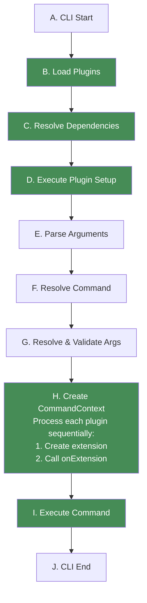
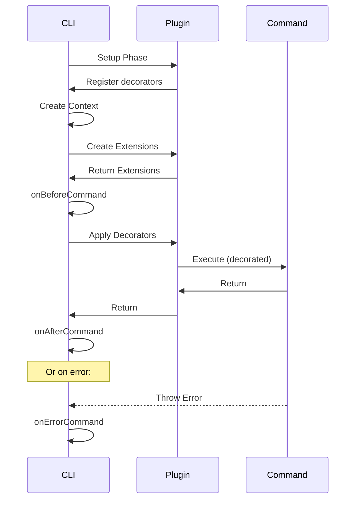

# Plugin Lifecycle

Understanding the Gunshi lifecycle is crucial for effective plugin development.

This guide explains how plugins integrate with the CLI execution flow and when different plugin features are activated.

## CLI Execution Lifecycle

When a Gunshi CLI application runs, it follows a specific sequence of steps from startup to completion.

The diagram below shows the complete execution flow, with plugin-related steps highlighted in green:



The lifecycle consists of 10 steps (A through J), where plugins are primarily involved in:

- **Steps B-D**: Plugin initialization and setup
- **Step H**: Plugin extension creation and activation during CommandContext creation
- **Step I**: Command execution with plugin decorators applied

## Plugin-Specific Lifecycle Steps

Plugins are primarily involved in specific steps of the CLI lifecycle.

This section focuses on the steps where plugins actively participate.

### Setup Phase (Steps B-D)

During the setup phase, plugins are loaded, dependencies are resolved, and plugin setup functions are executed.

This phase occurs once at CLI initialization.

**What happens in this phase:**

- Plugins configure the CLI by adding options, commands, and decorators
- All modifications are registered but not yet executed
- The `setup()` function runs for each plugin

#### Step B: Load Plugins

Plugins are collected from CLI options and prepared for initialization.

The following code shows how plugins are passed to the CLI function:

```js
import { cli } from 'gunshi'

await cli(args, command, {
  plugins: [
    plugin1(), // Collected
    plugin2(), // Collected
    plugin3() // Collected
  ]
})
```

#### Step C: Resolve Dependencies

Gunshi uses **topological sorting** to resolve plugin dependencies.

The following example demonstrates how plugins with dependencies are resolved in the correct order:

```js
import { plugin } from 'gunshi/plugin'

// Given these plugins:
const pluginA = plugin({
  id: 'a',
  dependencies: ['b', 'c']
})

const pluginB = plugin({
  id: 'b',
  dependencies: ['d']
})

const pluginC = plugin({
  id: 'c'
})

const pluginD = plugin({
  id: 'd'
})

// Resolution order: d → b → c → a
```

<!-- eslint-disable markdown/no-missing-label-refs -->

> [!TIP]
> For details on plugin dependency resolution, including circular dependency detection, optional dependencies, see [Plugin Dependencies](./dependencies.md).

<!-- eslint-enable markdown/no-missing-label-refs -->

#### Step D: Execute Plugin Setup

The `setup` function of each plugin is called in dependency order.

This example shows what actions a plugin can perform during setup:

```js
import { plugin } from 'gunshi/plugin'

const myPlugin = plugin({
  id: 'my-plugin',
  setup: ctx => {
    // This runs during Setup Phase
    console.log('Plugin setting up')

    // Add global options
    ctx.addGlobalOption('verbose', {
      type: 'boolean',
      description: 'Verbose output'
    })

    // Register sub-commands
    ctx.addCommand('plugin-cmd', {
      name: 'plugin-cmd',
      run: ctx => console.log('Plugin command')
    })

    // Add decorators (they stack in LIFO order)
    ctx.decorateCommand(baseRunner => async ctx => {
      console.log('Before command (from plugin)')
      const result = await baseRunner(ctx)
      console.log('After command (from plugin)')
      return result
    })
  }
})
```

### Command Processing (Steps E-H)

Between the setup phase and execution phase, Gunshi processes the command-line arguments and prepares the execution context:

- **Step E**: Parse command-line arguments into structured tokens
- **Step F**: Resolve which command to execute
- **Step G**: Validate arguments against the command's schema
- **Step H**: Create the CommandContext object

<!-- eslint-disable markdown/no-missing-label-refs -->

> [!NOTE]
> These internal processing steps are handled automatically by Gunshi. Plugin developers don't need to interact with these steps directly.

<!-- eslint-enable markdown/no-missing-label-refs -->

### Execution Phase (Steps H-I)

During the execution phase, the CommandContext is created with plugin extensions, and then the command is executed with all decorators applied.

### Step H: Create CommandContext & Process Plugins

The CommandContext is created and each plugin's extension is initialized:

1. Initialize CommandContext with parsed arguments and values
2. For each plugin (in dependency order):
   - Call the plugin's `extension()` function to create an extension
   - Store the extension in `context.extensions[pluginId]`
   - Immediately call the plugin's `onExtension()` callback if present

This sequential processing ensures extensions from dependencies are available to dependent plugins.

<!-- eslint-disable markdown/no-missing-label-refs -->

> [!NOTE]
> For detailed information about the extension lifecycle, including execution order guarantees, the relationship between `extension` and `onExtension`, and code examples, see the [Extension Lifecycle](./extensions.md#extension-lifecycle) section in the Plugin Extensions guide.

<!-- eslint-enable markdown/no-missing-label-refs -->

### Step I: Execute Command

The command runner executes with:

- All decorators applied in LIFO (Last In, First Out) order
- Full access to all plugin extensions via `ctx.extensions`
- Complete CommandContext with validated arguments

This example illustrates the command execution with decorator wrapping and extension usage:

```js
import { define } from 'gunshi'

// If plugins A, B, C add decorators in that order:
// Execution order: C → B → A → original command → A → B → C

const command = define({
  name: 'build',
  run: ctx => {
    // This is the original command
    ctx.extensions.logger.log('Building project...')
    // Build logic here
  }
})
```

## Extension Lifecycle in Detail

Understanding the relationship between `extension` and `onExtension` is crucial for effective plugin development.

During Step H (Create CommandContext):

- Each plugin is processed sequentially in dependency order
- For each plugin: the `extension` factory is called, then immediately its `onExtension` callback
- This sequential approach ensures that when a plugin's `onExtension` runs, all previous plugins' extensions are already available through `ctx.extensions`

<!-- eslint-disable markdown/no-missing-label-refs -->

> [!TIP]
> For a detailed visual representation of the extension lifecycle and execution order guarantees, see [Extension Lifecycle](./extensions.md#extension-lifecycle) in the Plugin Extensions guide.

<!-- eslint-enable markdown/no-missing-label-refs -->

## Lifecycle with Command Hooks

Gunshi provides Command hooks (`onBeforeCommand`, `onAfterCommand`, `onErrorCommand`) that integrate with the plugin lifecycle.

The following sequence diagram illustrates how these command hooks interact with plugins during command execution:

<!-- eslint-disable markdown/no-missing-label-refs -->

> [!TIP]
> For details on Command Hooks, including advanced use cases like logging, performance monitoring, validation guards, and transaction management, see [Command Hooks](../advanced/command-hooks.md).

<!-- eslint-enable markdown/no-missing-label-refs -->



This sequence shows:

1. **Setup Phase**: Plugins register their decorators during initialization
2. **Extension Creation**: Plugin extensions are created and returned to the CLI
3. **Command Hooks**: The `onBeforeCommand` hook runs before decorators and command execution
4. **Decorated Execution**: Plugin decorators wrap the command execution
5. **Post-Execution**: The `onAfterCommand` hook runs after successful completion
6. **Error Handling**: The `onErrorCommand` hook catches any errors during execution

## Complete Lifecycle Example

Here's a complete example showing all lifecycle phases including Command Hooks.

Plugin Codes:

```js [lifecycle.js]
import { plugin } from 'gunshi/plugin'

export default plugin({
  id: 'lifecycle',
  dependencies: ['logger'], // Step C: Dependency resolution

  // Step D: Setup execution
  setup: ctx => {
    console.log('1. lifecycle plugin setup phase started')

    // Register global option
    ctx.addGlobalOption('verbose', {
      type: 'boolean',
      alias: 'v',
      description: 'Verbose output'
    })

    // Add sub-command
    ctx.addCommand('status', {
      name: 'status',
      run: ctx => console.log('Status: OK')
    })

    // Register decorators (LIFO order)
    ctx.decorateCommand(runner => async ctx => {
      console.log('5. Command decorator (before)')
      const result = await runner(ctx)
      console.log('7. Command decorator (after)')
      return result
    })

    console.log('2. Setup phase completed')
  },

  // Step H: Extension creation (during CommandContext creation)
  extension: (ctx, cmd) => {
    console.log('3. Extension created for:', cmd.name)

    return {
      demo: () => 'Hello from extension',
      cleanup: () => console.log('9. Extension cleanup')
    }
  },

  // Step H: Post-extension callback (immediately after extension creation)
  onExtension: (ctx, cmd) => {
    console.log('4. All extensions ready')
  }
})
```

Application Codes:

```js [cli.js]
import { cli, define } from 'gunshi'
import logger from './logger.js'
import lifecycle from './lifecycle.js'

// Command definition
const command = define({
  name: 'build',
  args: {
    fail: {
      type: 'boolean'
    }
  },
  run: ctx => {
    console.log('6. Actual command execution')
    console.log('Extension says:', ctx.extensions['lifecycle'].demo())

    // Simulate an error for demonstration
    if (ctx.values.fail) {
      throw new Error('Build failed!')
    }
  }
})

// Running the CLI with Command Hooks
await cli(process.argv.slice(2), command, {
  // Plugin installation
  plugins: [logger, lifecycle],

  // Command Hooks are defined at CLI level
  onBeforeCommand: ctx => {
    console.log('4.5. onBeforeCommand hook')
  },

  onAfterCommand: ctx => {
    console.log('8. onAfterCommand hook')
    // Cleanup can be done here
    ctx.extensions['lifecycle'].cleanup()
  },

  onErrorCommand: (ctx, error) => {
    console.log('8. onErrorCommand hook:', error.message)
    // Error recovery or cleanup
    ctx.extensions['lifecycle'].cleanup()
  }
})
```

<!-- eslint-disable markdown/no-missing-label-refs -->

> [!TIP]
> The example fully code is [here](https://github.com/kazupon/gunshi/tree/main/playground/plugins/lifecycle).

<!-- eslint-enable markdown/no-missing-label-refs -->

Run your application with plugin:

```sh
node cli.js

logger plugin setup phase started
1. lifecycle plugin setup phase started
2. Setup phase completed
3. Extension created for: build
4. All extensions ready
4.5. onBeforeCommand hook
5. Command decorator (before)
6. Actual command execution
Extension says: Hello from extension
7. Command decorator (after)
8. onAfterCommand hook
9. Extension cleanup

node index.js --fail
logger plugin setup phase started
1. lifecycle plugin setup phase started
2. Setup phase completed
3. Extension created for: build
4. All extensions ready
4.5. onBeforeCommand hook
5. Command decorator (before)
6. Actual command execution
Extension says: Hello from extension
8. onErrorCommand hook: Build failed!
9. Extension cleanup
file:///path/to/projects/gunshi/playground/plugins/lifecycle/index.js:19
      throw new Error('Build failed!')
```

## Next Steps

Now that you understand how plugins integrate with the CLI lifecycle—from setup through command execution to cleanup—you're ready to explore how plugins can work together.

The next chapter, [Plugin Dependencies](./dependencies.md), will teach you how to build plugin ecosystems where plugins can depend on and interact with each other, enabling composition patterns for complex CLI applications.
