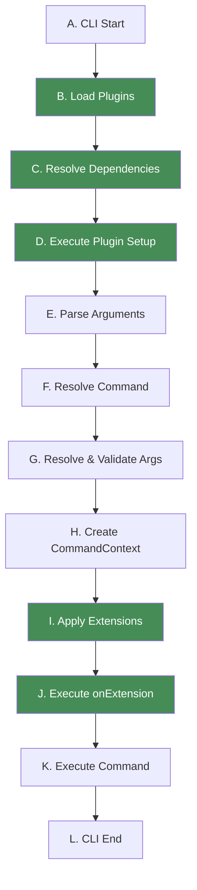
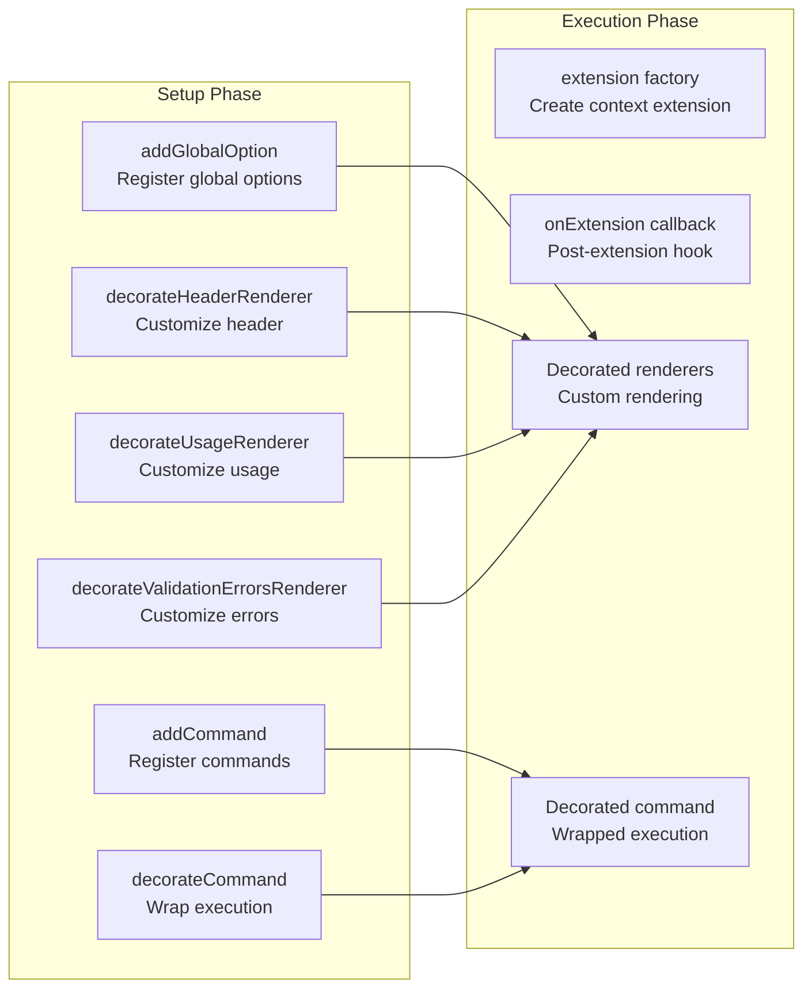

# `@gunshi/plugin`

[![Version][npm-version-src]][npm-version-href]
[![InstallSize][install-size-src]][install-size-src]
[![JSR][jsr-src]][jsr-href]

> plugin development kit for gunshi

This package provides comprehensive APIs and TypeScript type definitions for creating plugins for gunshi, a modern JavaScript command-line library.

<!-- eslint-disable markdown/no-missing-label-refs -->

> [!TIP]
> **The APIs and type definitions available in this package are the same as those in the `gunshi/plugin` entry in the `gunshi` package.**
> This package is smaller in file size than the `gunshi` package, making it suitable for use when you want to reduce the size of the 'node_modules' in the plugin package you are creating.

<!-- eslint-enable markdown/no-missing-label-refs -->

## 📚 Table of Contents

- [Overview](#-overview)
- [Features](#-features)
- [Installation](#-installation)
- [Quick Start](#-quick-start)
- [Gunshi Lifecycle and Plugins](#-gunshi-lifecycle-and-plugins)
- [Plugin in Depth](#-plugin-in-depth)
- [Plugin Communication & Collaboration](#-plugin-communication--collaboration)
- [Plugin Best Practices](#-plugin-best-practices)
- [Official Plugins](#-official-plugins)
- [Community Plugins](#-community-plugins)
- [API Reference](#-api-reference)

## 📜 Overview

Gunshi's plugin system is designed with a philosophy of **composability**, **type safety**, and **developer experience**. It allows you to extend CLI functionality in a modular way without modifying the core library.

### Why Plugins?

- **Separation of Concerns**: Keep core functionality minimal while enabling rich features through plugins
- **Reusability**: Share common functionality across multiple CLI applications
- **Type Safety**: Full TypeScript support with type inference for extensions
- **Ecosystem**: Build and share plugins with the community

### Package vs Entry Point

This package (`@gunshi/plugin`) contains the same exports as the `gunshi/plugin` entry point in the main gunshi package. Choose based on your needs:

- Use `@gunshi/plugin` when developing standalone plugin packages to minimize dependencies
- Use `gunshi/plugin` when plugins are part of your CLI application

## 🌟 Features

Plugins can extend gunshi in multiple ways:

### Extend CommandContext

Add custom properties to the command execution context that are available in all commands.

<!-- eslint-skip -->

```ts
// Plugin adds authentication info to context
ctx.extensions['auth'].user // { id: '123', name: 'John' }
```

### Decorate Renderers

Customize how help messages, usage information, and validation errors are displayed.

```ts
// Add colors, icons, or custom formatting
decorateHeaderRenderer((base, ctx) => `🚀 ${base(ctx)}`)
```

### Wrap Command Execution

Add pre/post processing logic around command execution.

```ts
// Add logging, timing, error handling
decorateCommand(runner => async ctx => {
  console.log('Before command')
  const result = await runner(ctx)
  console.log('After command')
  return result
})
```

### Add Global Options

Register options available to all commands.

```ts
// Add --verbose, --debug, etc.
addGlobalOption('verbose', { type: 'boolean', alias: 'v' })
```

### Add Sub Commands

Dynamically register new commands.

```ts
// Add utility commands like 'complete', 'config', etc.
addCommand('config', configCommand)
```

### Manage Plugin Dependencies

Declare dependencies between plugins with automatic resolution.

<!-- eslint-skip -->

```ts
// Ensure required plugins are loaded first
dependencies: ['logger', { id: 'cache', optional: true }]
```

## 💿 Installation

```sh
# npm
npm install --save @gunshi/plugin

# pnpm
pnpm add @gunshi/plugin

# yarn
yarn add @gunshi/plugin

# deno
deno add jsr:@gunshi/plugin

# bun
bun add @gunshi/plugin
```

## 🚀 Quick Start

### Minimal Plugin (No Extension)

```ts
import { plugin } from '@gunshi/plugin'

export default plugin({
  id: 'my-plugin',
  name: 'My First Plugin',

  setup(ctx) {
    console.log('Plugin loaded!')

    // Add a global --quiet option
    ctx.addGlobalOption('quiet', {
      type: 'boolean',
      alias: 'q',
      description: 'Suppress output'
    })
  }
})
```

### Plugin with Extension

```ts
import { plugin } from '@gunshi/plugin'

export interface LoggerExtension {
  log: (message: string) => void
  error: (message: string) => void
}

export default plugin({
  id: 'logger',
  name: 'Logger Plugin',

  // Called for each command execution
  extension: (ctx, cmd) => {
    const quiet = ctx.values.quiet ?? false

    return {
      log: (message: string) => {
        if (!quiet) {
          console.log(message)
        }
      },
      error: (message: string) => {
        console.error(message)
      }
    }
  },

  // Called after extension is applied
  onExtension: (ctx, cmd) => {
    ctx.extensions.logger.log('Logger initialized')
  }
})
```

## 🔄 Gunshi Lifecycle and Plugins

### CLI Execution Lifecycle



### Plugin Interaction Points

Plugins interact with gunshi at two distinct phases during the CLI lifecycle:

**Setup Phase** (steps B-D in the lifecycle):

- Occurs during plugin initialization
- Plugins configure the CLI by adding options, commands, and decorators
- All modifications are registered but not yet executed
- This is when the `setup()` function runs

**Execution Phase** (steps I-K in the lifecycle):

- Occurs when a command is actually being executed
- Extensions are created and applied to CommandContext
- Decorators are executed to modify behavior
- This is when `extension()` and `onExtension()` run

The following diagram shows how setup configurations connect to execution behaviors:



## 🔧 Plugin in Depth

### Plugin Dependency Resolution

Gunshi uses **topological sorting** to resolve plugin dependencies, ensuring plugins are loaded in the correct order.

#### Resolution Process

1. **Build Dependency Graph**: Create a directed graph of plugin dependencies
2. **Detect Cycles**: Check for circular dependencies (throws error if found)
3. **Topological Sort**: Order plugins so dependencies load before dependents
4. **Load Plugins**: Execute setup in resolved order

Example:

```ts
// Given these plugins:
const pluginA = plugin({
  id: 'a',
  dependencies: ['b', 'c']
})

const pluginB = plugin({
  id: 'b',
  dependencies: ['d']
})

const pluginC = plugin({
  id: 'c'
})

const pluginD = plugin({
  id: 'd'
})

// Resolution order: d → b → c → a
```

#### Optional Dependencies

```ts
plugin({
  id: 'logger',
  dependencies: [
    'core', // Required: throws if missing
    { id: 'colors', optional: true } // Optional: continues if missing
  ],

  setup(ctx) {
    // Check if optional dependency loaded
    if (ctx.hasCommand('colors')) {
      // Use colors functionality
    }
  }
})
```

### Decorators

Decorators in gunshi follow the **LIFO (Last In, First Out)** pattern.

#### Execution Order

```ts
// Registration order
ctx.decorateCommand(decoratorA) // Registered first
ctx.decorateCommand(decoratorB) // Registered second
ctx.decorateCommand(decoratorC) // Registered third

// Execution order: C → B → A → original
```

#### Renderer Decorators

Renderer decorators allow you to customize how gunshi displays various output elements like headers, usage information, and error messages. They wrap the base renderer functions to modify or enhance their output.

**Common Use Cases:**

- Adding colors or styling to output
- Wrapping content in boxes or borders
- Adding additional help information
- Translating or localizing messages
- Formatting errors for better readability

```ts
plugin({
  setup(ctx) {
    // Header decorator - Customize command header display
    ctx.decorateHeaderRenderer(async (baseRenderer, ctx) => {
      const header = await baseRenderer(ctx)
      // Add a decorative box around the header
      return `╭─────────────────╮\n│ ${header} │\n╰─────────────────╯`
    })

    // Usage decorator - Enhance help message
    ctx.decorateUsageRenderer(async (baseRenderer, ctx) => {
      const usage = await baseRenderer(ctx)
      // Append additional help resources
      return usage + '\n\nFor more help: https://docs.example.com'
    })

    // Validation errors decorator - Format error display
    ctx.decorateValidationErrorsRenderer(async (baseRenderer, ctx, error) => {
      const errors = await baseRenderer(ctx, error)
      // Add error icon and formatting
      return `❌ Validation Failed\n\n${errors}`
    })
  }
})
```

**Example Output:**

```sh
# Before decoration (plain):
my-cli deploy - Deploy application

# After header decoration:
╭─────────────────╮
│ my-cli deploy - Deploy application │
╰─────────────────╯
```

#### Command Decorators

Command decorators wrap the actual command execution, allowing you to add behavior before and after commands run. They're perfect for cross-cutting concerns that apply to all commands.

**Common Use Cases:**

- Performance monitoring and timing
- Logging and auditing
- Error handling and recovery
- Authentication checks
- Transaction management
- Resource cleanup

```ts
plugin({
  setup(ctx) {
    // Timing decorator - Measure execution time
    ctx.decorateCommand(runner => async ctx => {
      const start = performance.now()
      console.log(`🚀 Starting command: ${ctx.name || 'root'}`)

      try {
        const result = await runner(ctx)
        const duration = performance.now() - start
        console.log(`✅ Completed in ${duration.toFixed(2)}ms`)
        return result
      } catch (error) {
        const duration = performance.now() - start
        console.log(`❌ Failed after ${duration.toFixed(2)}ms`)
        throw error
      }
    })

    // Error handling decorator - Enhance error reporting
    ctx.decorateCommand(runner => async ctx => {
      try {
        return await runner(ctx)
      } catch (error) {
        // Log detailed error information
        console.error('Command failed:', error.message)
        console.error('Context:', {
          command: ctx.name,
          args: ctx.values,
          positionals: ctx.positionals
        })

        // Could also send to error tracking service
        // await errorTracker.report(error, ctx)

        throw error
      }
    })

    // Authentication decorator - Ensure user is authenticated
    ctx.decorateCommand(runner => async ctx => {
      const auth = ctx.extensions.auth

      if (auth && !auth.isAuthenticated()) {
        throw new Error('Authentication required. Please login first.')
      }

      return await runner(ctx)
    })
  }
})
```

**Execution Flow Example:**

When multiple decorators are applied, they execute in LIFO order:

```sh
User runs command
  → Authentication decorator (last registered)
    → Error handling decorator
      → Timing decorator (first registered)
        → Actual command execution
```

## 🤝 Plugin Communication & Collaboration

Gunshi's plugin system provides strong type safety for plugin interactions through TypeScript's type system. This section explains how to create type-safe plugin ecosystems where plugins can communicate and share functionality.

### Type-Safe Access to Other Plugin Extensions

The `plugin` function supports type parameters that allow you to declare and access other plugin extensions with full type safety:

```ts
import { plugin } from '@gunshi/plugin'

// Define extension interfaces for each plugin
export interface LoggerExtension {
  log: (message: string) => void
  error: (message: string) => void
  debug: (message: string) => void
}

export interface AuthExtension {
  isAuthenticated: () => boolean
  getUser: () => { id: string; name: string }
  getToken: () => string | undefined
}

// Logger plugin - provides LoggerExtension
export const loggerPlugin = plugin({
  id: 'logger',
  name: 'Logger Plugin',

  extension: (): LoggerExtension => ({
    log: (message: string) => console.log(`[LOG] ${message}`),
    error: (message: string) => console.error(`[ERROR] ${message}`),
    debug: (message: string) => console.debug(`[DEBUG] ${message}`)
  })
})

// Auth plugin - provides AuthExtension and uses LoggerExtension
export const authPlugin = plugin<
  { logger: LoggerExtension }, // Declare dependency extensions
  'auth', // Plugin ID as literal type
  ['logger'], // Plugin Dependencies type
  AuthExtensions // Extension factory return type
>({
  id: 'auth',
  name: 'Authentication Plugin',
  dependencies: ['logger'], // dependency declaration

  setup: ctx => {
    // Type-safe access to logger in setup
    ctx.decorateCommand(runner => async cmdCtx => {
      // cmdCtx.extensions is typed as { auth: AuthExtension, logger: LoggerExtension }
      cmdCtx.extensions.logger.log('Command started')
      return await runner(cmdCtx)
    })
  },

  extension: ctx => {
    // ctx.extensions.logger is fully typed as LoggerExtension
    ctx.extensions.logger.log('Auth plugin initializing')

    return {
      isAuthenticated: () => {
        const token = process.env.AUTH_TOKEN
        return Boolean(token)
      },
      getUser: () => ({
        id: '123',
        name: 'John Doe'
      }),
      getToken: () => process.env.AUTH_TOKEN
    }
  },

  onExtension: ctx => {
    // Both extensions are available and typed
    if (ctx.extensions.auth.isAuthenticated()) {
      ctx.extensions.logger.log('User authenticated')
    }
  }
})
```

### Type-Safe Plugin Extensions in Commands

When defining commands, you can specify which plugin extensions your command requires, and TypeScript will ensure type safety:

```ts
import { define, CommandContext } from 'gunshi'
import type { LoggerExtension, AuthExtension, DatabaseExtension } from 'your-plugin'

// Define the extensions your command needs
type MyCommandExtensions = {
  logger: LoggerExtension
  auth: AuthExtension
  db?: DatabaseExtension // Optional extension
}

// Define command with typed extensions
export const deployCommand = define<MyCommandExtensions>({
  name: 'deploy',
  description: 'Deploy the application',
  run: async ctx => {
    // All extensions are fully typed
    const { logger, auth, db } = ctx.extensions

    // Type-safe usage
    if (!auth.isAuthenticated()) {
      logger.error('Authentication required')
      throw new Error('Please login first')
    }

    const user = auth.getUser()
    logger.log(`Deploying as ${user.name}`)

    // Optional extension with safe access
    await db?.logDeployment(user.id, ctx.values.environment)

    // Command implementation...
  }
})
```

## 💡 Plugin Best Practices

### Plugin Package Naming Conventions

Follow these naming conventions for consistency:

- **Standalone packages**: `gunshi-plugin-{feature}`
  - Example: `gunshi-plugin-logger`, `gunshi-plugin-auth`
- **Scoped packages**: `@{scope}/plugin-{feature}`
  - Example: `@mycompany/plugin-logger`

### Plugin ID Namespacing & Definition

Use namespaced IDs to avoid conflicts and export them for reusability:

```ts
// ✅ Good: namespaced
plugin({ id: 'mycompany:auth' })
plugin({ id: 'g:renderer' }) // 'g:' for gunshi official

// ❌ Bad: might conflict
plugin({ id: 'auth' })
plugin({ id: 'logger' })
```

**Export your plugin ID to prevent hardcoding:**

By exporting your plugin ID, you enable other plugin authors and users to reference it without hardcoding strings:

<!-- eslint-skip -->

```ts
// Export plugin ID as a constant
export const pluginId = 'mycompany:auth' as const

// Export plugin ID type for `plugin` function type parameters
export type PluginId = typeof pluginId

// your-plugin/src/index.ts
import { pluginId } from './types.ts'

export { pluginId } from './types.ts' // Re-export for consumers

export default function auth() {
  return plugin({
    id: pluginId // Use the constant instead of hardcoding
    // ...
  })
}
```

**Benefits for other plugin authors:**

Other plugins can now import and use your plugin ID directly:

```ts
// another-plugin/src/index.ts
import { pluginId as authPluginId } from 'your-auth-plugin'
import type { PluginId as AuthId, AuthExtension } from 'your-auth-plugin'

export const pluginId = 'mycompany:api' as const
export type PluginId = typeof pluginId

// Define plugin extension for user ...
export interface ApiExtension {
  // ...
}

// Use imported ID instead of hardcoding 'mycompany:auth'
const dependencies = [authPluginId] as const

export default function api() {
  // Set Auth Plugin Extension to type parameters to use it as typed extensions
  return plugin<Record<AuthId, AuthExtension>, PluginId, typeof dependencies, ApiExtension>({
    id: pluginId,
    dependencies,

    onExtension: ctx => {
      // Access extension using imported ID
      const auth = ctx.extensions[authPluginId]

      if (auth.isAuthenticated()) {
        // Use auth features
      }
    }
  })
}
```

**Benefits for plugin users:**

Users can also access extensions without hardcoding plugin IDs:

```ts
// user-code.ts
import { define } from 'gunshi'
import auth, { pluginId as authId } from 'your-auth-plugin'
import type { AuthExtension, PluginId as AuthId } from 'your-auth-plugin'

const myCommand = define<Record<AuthId, AuthExtension>>({
  name: 'deploy',

  run: ctx => {
    // Type-safe access using imported plugin id, no hardcoded 'mycompany:auth' strings!
    const auth = ctx.extensions[authId]

    if (!auth.isAuthenticated()) {
      throw new Error('Please login first')
    }
  }
})
```

**Complete example with multiple plugins:**

```ts
// Export all plugin IDs from a central location
// plugins/index.ts
export { pluginId as authPluginId } from '@mycompany/plugin-auth'
export { pluginId as loggerPluginId } from '@mycompany/plugin-logger'
export { pluginId as dbPluginId } from '@mycompany/plugin-database'

// Use them consistently across your application
import { cli } from 'gunshi'
import auth, { pluginId as authId } from '@mycompany/plugin-auth'
import logger, { pluginId as loggerId } from '@mycompany/plugin-logger'
import db, { pluginId as dbId } from '@mycompany/plugin-database'

// Import extension types
import type { PluginId as AuthId, AuthExtension } from '@mycompany/plugin-auth'
import type { PluginId as LoggerId, LoggerExtension } from '@mycompany/plugin-logger'
import type { PluginId as DbId, DbExtension } from '@mycompany/plugin-database'

// Define extensions to use it for command context as typed extensions
type Extensions = Record<AuthId, AuthExtension> &
  Record<LoggerId, LoggerExtension> &
  Record<DbId, DbExtension>

await cli<Extensions>(
  process.argv.slice(2),
  // Entry command
  async ctx => {
    // All plugin IDs are imported, no hardcoding needed
    const auth = ctx.extensions[authId]
    const logger = ctx.extensions[loggerId]
    const db = ctx.extensions[dbId]

    logger.log('Application started')

    if (auth.isAuthenticated()) {
      await db.connect()
    }
  },
  // CLI options
  {
    plugins: [auth(), logger(), db()] // Install plugins
  }
)
```

### Declare Plugin Dependencies Explicitly

Always declare your plugin dependencies explicitly to ensure proper initialization order and availability:

<!-- eslint-skip -->

```ts
dependencies: ['required-plugin', { id: 'optional-plugin', optional: true }]
```

**Why explicit dependencies are important:**

1. **Guaranteed Load Order**: Gunshi uses topological sorting to ensure dependencies are loaded before dependent plugins
2. **Runtime Safety**: Required dependencies throw errors if missing, preventing runtime failures
3. **Optional Flexibility**: Optional dependencies allow graceful degradation when plugins aren't available
4. **Clear Documentation**: Dependencies are self-documenting, making it clear what plugins work together
5. **Type Safety**: When combined with TypeScript, dependencies enable proper type checking of extensions

**Example with reasoning:**

```ts
export default function analytics() {
  return plugin({
    id: 'mycompany:analytics',

    // Declare dependencies explicitly
    dependencies: [
      'mycompany:logger', // Required: analytics needs logging
      'mycompany:auth', // Required: need user info for tracking
      { id: 'mycompany:database', optional: true } // Optional: can work without persistence
    ],

    extension: ctx => {
      // Required dependencies are guaranteed to exist
      const logger = ctx.extensions['mycompany:logger'] // Safe to access
      const auth = ctx.extensions['mycompany:auth'] // Safe to access

      // Optional dependencies might be undefined
      const db = ctx.extensions['mycompany:db'] // May be undefined

      return {
        track: async (event: string, data: unknown) => {
          const user = auth.getUser()
          logger.log(`Track: ${event} by ${user.id}`)

          // Gracefully handle optional dependency
          if (db) {
            await db.store('analytics', { event, user, data })
          } else {
            logger.warn('Analytics not persisted (database plugin not available)')
          }
        }
      }
    }
  })
}
```

**Benefits of explicit dependencies:**

- **Fail Fast**: Missing required plugins fail at startup, not runtime
- **Predictable**: Plugin loading order is deterministic
- **Maintainable**: Easy to see and update plugin relationships
- **Testable**: Can mock dependencies in tests

### Avoid Circular Dependencies

<!-- eslint-skip -->

```ts
// ❌ Bad: Circular dependency
pluginA: {
  dependencies: ['pluginB']
}
pluginB: {
  dependencies: ['pluginA']
}

// ✅ Good: Extract shared functionality
pluginShared: {
  /* shared logic */
}
pluginA: {
  dependencies: ['pluginShared']
}
pluginB: {
  dependencies: ['pluginShared']
}
```

### Gracefully Handle Optional Dependencies

When declaring optional dependencies, your plugin must be designed to work correctly even when those dependencies are not installed. This ensures your plugin can adapt to different environments and configurations.

**Key principles:**

1. **Always check for existence** before using optional dependencies
2. **Provide fallback behavior** when optional dependencies are unavailable
3. **Don't assume optional dependencies exist** in any part of your code
4. **Test your plugin** with and without optional dependencies

**Example implementation pattern:**

```ts
import { pluginId as i18nPluginId, resolveKey } from '@gunshi/plugin-i18n'
import type { I18nExtension } from '@gunshi/plugin-i18n'

export const pluginId = 'g:renderer' as const

export interface UsageRendererExtension {
  // ...
}

const dependencies = [i18nPluginId] as const

export default function renderer() {
  return plugin<
    Record<typeof i18nPluginId, I18nExtension>,
    typeof id,
    typeof dependencies,
    UsageRendererExtension
  >({
    id: pluginId,
    name: 'Usage Renderer',
    dependencies,

    extension: (ctx, cmd) => {
      // Get optional extension (may be undefined)
      const i18n = ctx.extensions[i18nPluginId]

      return {
        // Gracefully handle missing i18n plugin
        text: localizable(ctx, cmd, i18n?.translate), // Pass undefined if i18n not available

        renderHelp: ctx => {
          // eslint-disable-next-line unicorn/prefer-ternary -- example
          if (i18n) {
            // Use i18n features when available
            return i18n.translate(resolveKey('message', ctx))
          } else {
            // Fallback to default behavior
            return 'Help message'
          }
        }
      }
    },

    onExtension: async (ctx, cmd) => {
      const i18n = ctx.extensions[i18nPluginId]

      // Only use optional features if available
      if (i18n) {
        await i18n.loadResource(ctx.locale, ctx, cmd)
      }

      // Core functionality works regardless
      console.log('Renderer plugin initialized')
    }
  })
}
```

**Implementing adaptive functionality:**

```ts
// Helper function that works with or without optional dependency
function localizable(ctx: CommandContext, cmd: Command, translate?: TranslateFunction) {
  return (key: string, values?: Record<string, unknown>) => {
    // eslint-disable-next-line unicorn/prefer-ternary -- example
    if (translate) {
      // Use translation when available
      return translate(key, values)
    } else {
      // Fallback to key or default resource
      return DefaultResource[key] || key
    }
  }
}
```

**Benefits of this approach:**

- **Flexibility**: Users can choose which plugins to install
- **Reduced dependencies**: Core functionality doesn't require all plugins
- **Better performance**: Smaller installation size when optional plugins are omitted
- **Graceful degradation**: Features degrade smoothly rather than failing completely

### Use extensions with optional chaining

Plugin extensions are dynamically injected, so it is safe to use optional chaining in the following cases.

#### Optional plugin dependencies

If your plugin depends on a specific plugin extension, we recommend using an option chain when using that extension:

```ts
import { pluginId as loggerPluginId } from 'your-auth-logger'
import type { PluginId as LoggerId, LoggerExtension } from 'your-logger-plugin'

export const pluginId = 'my:api' as const
export type PluginId = typeof pluginId

export interface ApiExtension {}

// Depend on optional plugin
const dependencies = [{ id: 'my:logger', optional: true }] as const

export default function api() {
  return plugin<Record<LoggerId, LoggerExtension>, PluginId, typeof dependencies, ApiExtension>({
    id: pluginId,
    dependencies,
    onExtension: ctx => {
      // May be `undefined`
      const logger = ctx.extensions[LoggerId]

      // Safe access
      logger?.log('message')
    }
  })
}
```

#### Command definition

If the `define` function has an implementation that depends on a specific plugin extension, it's recommended to use optional chaining to use the extension:

```ts
import { define } from 'gunshi'
import auth, { pluginId as authId } from 'your-auth-plugin'
import type { AuthExtension, PluginId as AuthId } from 'your-auth-plugin'

const myCommand = define<Record<AuthId, AuthExtension>>({
  // ...

  run: async ctx => {
    const auth = ctx.extensions[authId] // Maybe `undefined`

    // Use safelly extensions with optional chaining
    if (auth?.isAuthenticated()) {
      // For login ...
    } else {
      throw new Error('Please login first')
    }
  }
})
```

## 📚 Official Plugins

Learn from gunshi's official plugins:

### `@gunshi/plugin-global`

- **Pattern**: Global options, command interception
- **Learn**: How to add universal CLI features

### `@gunshi/plugin-i18n`

- **Pattern**: Complex extensions, resource loading
- **Learn**: How to manage stateful extensions

### `@gunshi/plugin-renderer`

- **Pattern**: Renderer decorators
- **Learn**: How to customize output formatting

### `@gunshi/plugin-completion`

- **Pattern**: Dynamic command generation
- **Learn**: How to add utility commands

## 👥 Community Plugins

<!-- eslint-disable markdown/no-missing-label-refs -->

> [!NOTE]
> Welcome your plugins! Submit a PR to add your plugin to this list.

<!-- eslint-enable markdown/no-missing-label-refs -->

## 📖 API Reference

TODO: referer the API section of gunshi docs

## ©️ License

[MIT](http://opensource.org/licenses/MIT)

<!-- Badges -->

[npm-version-src]: https://img.shields.io/npm/v/@gunshi/plugin?style=flat
[npm-version-href]: https://npmjs.com/package/@gunshi/plugin@alpha
[jsr-src]: https://jsr.io/badges/@gunshi/plugin
[jsr-href]: https://jsr.io/@gunshi/plugin
[install-size-src]: https://pkg-size.dev/badge/install/27672
